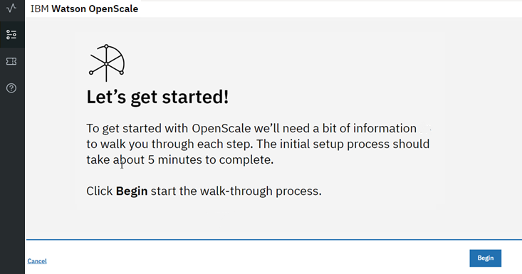
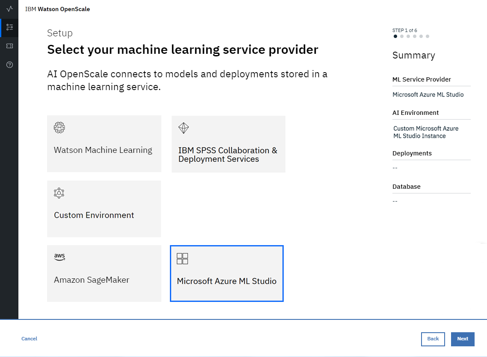
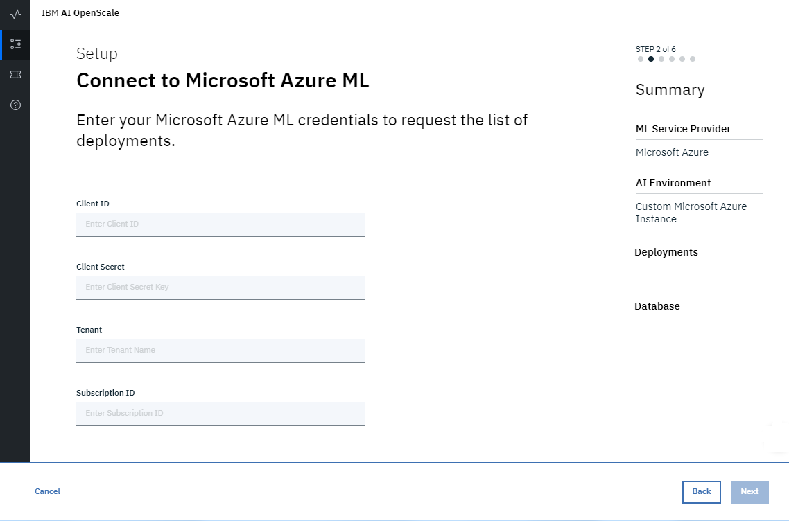
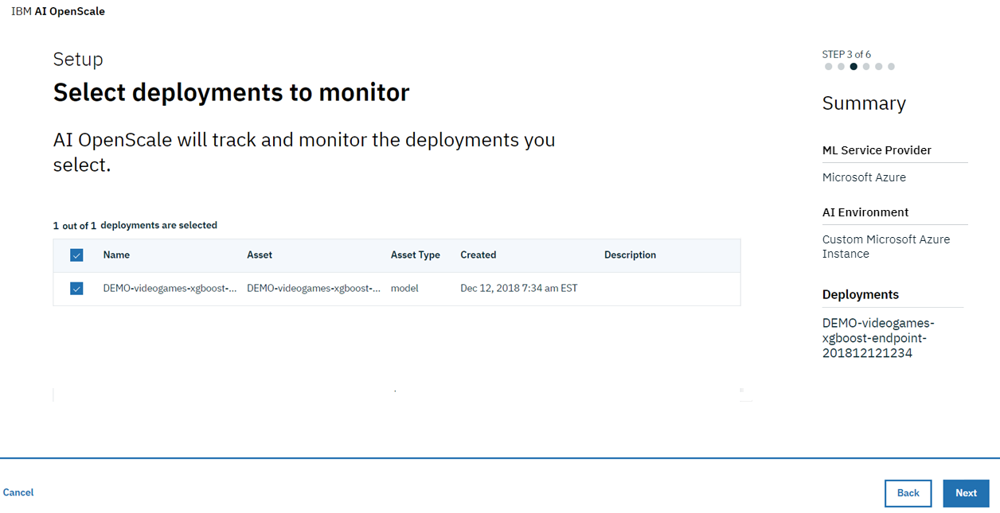

---

copyright:
  years: 2018
lastupdated: "2018-12-12"

---

{:shortdesc: .shortdesc}
{:new_window: target="_blank"}
{:tip: .tip}
{:important: .important}
{:note: .note}
{:pre: .pre}
{:codeblock: .codeblock}
{:screen: .screen}

# Specify your Azure ML service
{: #connect-azure}

Your first step in the {{site.data.keyword.aios_short}} tool is to specify a Microsoft Azure ML service instance. Your Azure ML service instance is where you store your AI models and deployments.
{: shortdesc}

## Connect your Azure ML service instance
{: #config-azure}

{{site.data.keyword.aios_short}} connects to AI models and deployments in a Azure ML service instance.

1.  From the home page of the {{site.data.keyword.aios_short}} tool, click **Begin**.

    

1.  Select the **Microsoft Azure** tile and click **Next**.

    

1.  Enter your credentials:

    

1.  Click **Next**.

1.  {{site.data.keyword.aios_short}} will list your deployed models; select the ones you want to monitor

    

1.  Click **Next**.

### Next steps
{: #payload-logging}

{{site.data.keyword.aios_short}} is now ready for you to [specify your database](connect-db.html).
