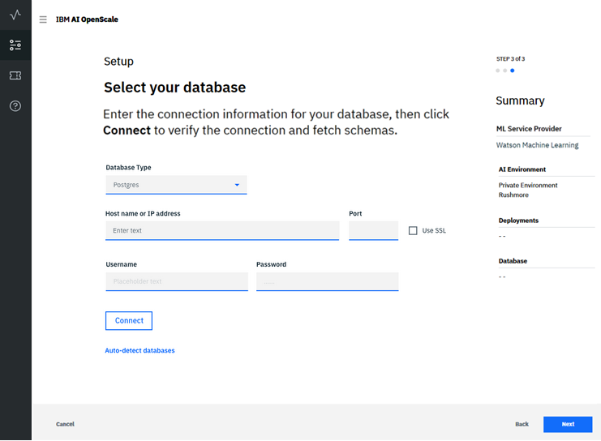

---

copyright:
  years: 2018
lastupdated: "2018-12-13"

---

{:shortdesc: .shortdesc}
{:new_window: target="_blank"}
{:tip: .tip}
{:important: .important}
{:note: .note}
{:pre: .pre}
{:codeblock: .codeblock}
{:screen: .screen}

# Specify your database
{: #connect-db}

Specify a database for your {{site.data.keyword.aios_short}} instance to use.
{: shortdesc}

## Connecting to your database
{: #connect-config-db}

{{site.data.keyword.aios_short}} uses a database to store payload, feedback, and measurement data. Besides selecting a database, you may also select a schema for your database - a schema is a named collection of tables in the database.

1.  Choose a database. You have two options: the free Lite plan database, or an existing or new database.

    

### Free Lite plan database

**NOTE**: The free Lite plan database has some important limitations:

- The free Lite plan database is hosted, and is not directly accessible to you.
- {{site.data.keyword.aios_full}} will have full access to your database, and thus will have full access to your data.
- The free Lite plan database is not GDPR-compliant. If your model processes personally-identifiable information (PII), you cannot use the free Lite plan database. You must purchase a new database, or use an existing database that conforms to GDPR rules. See [Information security](information-security.html) to learn more.

To proceed with using the free Lite plan database, simply select that option, then review the summary data and click **Save**.

  

### Existing or new database

1.  Once you have selected the "Use existing or purchase new database" option, {{site.data.keyword.aios_short}} checks your {{site.data.keyword.Bluemix_notm}} account to locate any existing databases.

    For the current release, only a Db2 database is supported.
  {: note}

1.  Select your existing database type (Db2), then a database from the **Database** drop-down menu, and then a **Schema**:

    

    You can also click **Select a different location** to specify a database location outside of your {{site.data.keyword.Bluemix_notm}} account.

1.  Select the **Database Type**, then fill in the connection information for your database location and click **Connect**:

    

1.  Once you have successfully connected, you can select a schema.

    

Click **Next** to review the summary data and click **Save**.

## Sending a scoring request

To configure monitors, {{site.data.keyword.aios_short}} requires you to send a scoring request, in order to begin to log the data that will be monitored.

Models deployed in Watson Machine Learning are automatically scored by {{site.data.keyword.aios_short}}. If you only have models deployed in Watson Machine Learning, you will not see this screen.
{: note:}

Select a deployment, in this case "Fraud Detector", and then use the provided `cURL` or `Python` code snippets to log model deployment request and response data.

The fields and values in the code snippets need to be substituted with your real values, as the ones provided are only examples.
{: important}

Once you have run your payload logging, you will see a checkmark in the "Ready to Monitor" column for the selected deployment. Click **Configure Monitors** to continue.

## Next steps
{: #connect-next}

{{site.data.keyword.aios_short}} is now ready for you to [configure monitors for your deployments](monitor-overview.html).
