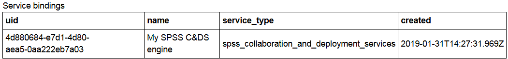
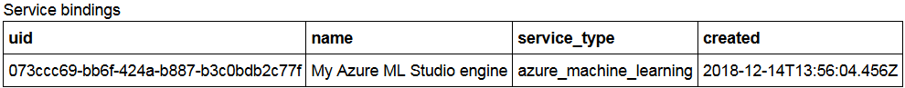
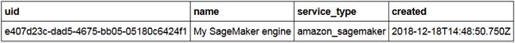

---

copyright:
  years: 2018, 2019
lastupdated: "2019-02-04"

---

{:shortdesc: .shortdesc}
{:new_window: target="_blank"}
{:tip: .tip}
{:important: .important}
{:note: .note}
{:pre: .pre}
{:codeblock: .codeblock}
{:screen: .screen}

# Payload logging for non-Watson Machine Learning service instances
{: #cml-ml}

If your AI model is deployed in a machine learning engine other than Watson Machine Learning (WML), you must enable payload logging for the external machine learning engine with a Python client.
{: shortdesc}

See more complete information in the [{{site.data.keyword.aios_short}} Python client documentation](http://ai-openscale-python-client.mybluemix.net/), and in the sample {{site.data.keyword.aios_short}} Python client notebooks that are part of the [AI OpenScale tutorials](https://github.com/pmservice/ai-openscale-tutorials/blob/master/README.md).

## Before you begin
{: #cml-prereq}

You will need to have the training data of your model available in Db2 or Cloud Object Storage to monitor bias for your model. Explainability and accuracy is not supported for Python functions.

- Import and initiate {{site.data.keyword.aios_short}}

    ```python
    from ibm_ai_openscale import APIClient

    aios_credentials = {
      "instance_guid": "***",
      "url": "https://api.aiopenscale.cloud.ibm.com",
      "apikey": "***"
    }

    client = APIClient(service_credentials)
    ```
  Credentials can be found by following the steps shown in the "[Creating credentials](creds.html)" topic.

- Create a schema name in your PostgreSQL database

- Set up a datamart

    ```python
    client.data_mart.setup(db_credentials=postgres_credentials, schema=schemaName)

    client.data_mart.get_details()
    ```

## Working with the Custom machine learning engine
{: #cml-custom}

### Bind your Custom machine learning engine

- A non-WML engine is bound as Custom, meaning that this is just metadata; there is no direct integration with the non-WML service.

    ```python
    custom_engine_credentials = {
    "url": "***",
    "username": "***",
    "password": "***"
    }

    binding_uid = client.data_mart.bindings.add('My custom engine', CustomMachineLearningInstance(custom_engine_credentials))

    bindings_details = client.data_mart.bindings.get_details()
    ```
  You can see your service binding with the following command:

    ```python
    client.data_mart.bindings.list()
    ```

    

### Add Custom subscription

- Add subscription

    ```python
    client.data_mart.subscriptions.add(CustomMachineLearningAsset(source_uid='action', binding_uid=binding_uid, prediction_column='predictedActionLabel'))
    ```

- Get subscription list

    ```python
    subscriptions = client.data_mart.subscriptions.get_details()

    subscriptions_uids = client.data_mart.subscriptions.get_uids()
    print(subscriptions_uids)
    ```

### Enable payload logging

- Enable payload logging in subscription

    ```python
    subscription.payload_logging.enable()
    ```

- Get logging details

    ```python
    subscription.payload_logging.get_details()
    ```

### Scoring and payload logging

- Score your model, then convert the request and response to the form used by {{site.data.keyword.aios_short}}. For a full example, see the [IBM AI OpenScale & Custom ML engine notebook](https://github.com/pmservice/ai-openscale-tutorials/blob/master/notebooks/AI%20OpenScale%20and%20Custom%20ML%20Engine.ipynb).

- Store the request and response in the payload logging table

    ```python
    records_list = [PayloadRecord(request=request_data, response=response_data, response_time=response_time), PayloadRecord(request=request_data, response=response_data, response_time=response_time)]

    subscription.payload_logging.store(records=records_list)
    ```
    **Note**: For languages other than Python, you can also perform payload logging directly, using a REST API.

    ```json
    token_endpoint = "https://iam.bluemix.net/identity/token"
    headers = {
            "Content-Type": "application/x-www-form-urlencoded",
            "Accept": "application/json"
    }

    data = {
            "grant_type":"urn:ibm:params:oauth:grant-type:apikey",
            "apikey":aios_credentials["apikey"]
    }

    req = requests.post(token_endpoint, data=data, headers=headers)
    token = req.json()['access_token']
    ```

    ```json
    import requests, uuid

    PAYLOAD_STORING_HREF_PATTERN = '{}/v1/data_marts/{}/scoring_payloads'
    endpoint = PAYLOAD_STORING_HREF_PATTERN.format(aios_credentials['url'], aios_credentials['data_mart_id'])

    payload = [{
      'binding_id': binding_uid,
      'deployment_id': subscription.get_details()['entity']['deployments'][0]['deployment_id'],
      'subscription_id': subscription.uid,
      'scoring_id': str(uuid.uuid4()),
      'response': response_data,
      'request': request_data
    }]

    headers = {"Authorization": "Bearer " + token}
    req_response = requests.post(endpoint, json=payload, headers = headers)
    print("Request OK: " + str(req_response.ok))
    ```

## Working with the IBM SPSS Collaboration & Deployment Services machine learning engine
{: #cml-spss}

### Bind your IBM SPSS C&DS machine learning engine

- An IBM SPSS C&DS engine is bound as Custom, meaning that this is just metadata; there is no direct integration with the non-WML service.

    ```python
    SPSS_CDS_ENGINE_CREDENTIALS = {
    "username": "***",
    "password": "***",
    "url": "***"
    }

    binding_uid = client.data_mart.bindings.add('My SPSS C&DS engine', SPSSMachineLearningInstance(SPSS_CDS_ENGINE_CREDENTIALS))

    bindings_details = client.data_mart.bindings.get_details()
    ```
  You can see your service binding with the following command:

    ```python
    client.data_mart.bindings.list()
    ```

    

### Add IBM SPSS C&DS subscription

- Add subscription

    ```python
    client.data_mart.subscriptions.add(SPSSMachineLearningAsset(source_uid='source_uid', binding_uid=binding_uid, prediction_column='predictedActionLabel'))
    ```

- Get subscription list

    ```python
    subscriptions = client.data_mart.subscriptions.get_details()

    subscriptions_uids = client.data_mart.subscriptions.get_uids()
    print(subscriptions_uids)
    ```

### Scoring and payload logging

- Score your model, then convert the request and response to the form used by {{site.data.keyword.aios_short}}. For a full example, see the [IBM AI OpenScale & SPSS C&DS engine notebook](https://github.com/pmservice/ai-openscale-tutorials/blob/master/notebooks/AI%20OpenScale%20and%20SPSS%20C%26DS%20Engine.ipynb).

- Store the request and response in the payload logging table

    ```python
    records_list = [PayloadRecord(request=scoring_payload, response=result, response_time=response_time), PayloadRecord(request=scoring_payload, response=result, response_time=response_time)]

    subscription.payload_logging.store(records=records_list)
    ```

<!---
    **Note**: For languages other than Python, you can also perform payload logging directly, using a REST API.

    ```bash
    token_endpoint = "https://iam.bluemix.net/identity/token"
    headers = {
            "Content-Type": "application/x-www-form-urlencoded",
            "Accept": "application/json"
    }

    data = {
            "grant_type":"urn:ibm:params:oauth:grant-type:apikey",
            "apikey":aios_credentials["apikey"]
    }

    req = requests.post(token_endpoint, data=data, headers=headers)
    token = req.json()['access_token']
    ```

    ```json
    import requests, uuid

    PAYLOAD_STORING_HREF_PATTERN = '{}/v1/data_marts/{}/scoring_payloads'
    endpoint = PAYLOAD_STORING_HREF_PATTERN.format(aios_credentials['url'], aios_credentials['data_mart_id'])

    payload = [{
      'binding_id': binding_uid,
      'deployment_id': subscription.get_details()['entity']['deployments'][0]['deployment_id'],
      'subscription_id': subscription.uid,
      'scoring_id': str(uuid.uuid4()),
      'response': response_data,
      'request': request_data
    }]

    headers = {"Authorization": "Bearer " + token}
    req_response = requests.post(endpoint, json=payload, headers = headers)
    print("Request OK: " + str(req_response.ok))
    ```
--->

## Working with the Microsoft Azure machine learning engine
{: #cml-azure}

### Bind your MS Azure ML engine

- A non-WML engine is bound as Custom, meaning that this is just metadata; there is no direct integration with the non-WML service.

    ```python
    AZURE_ENGINE_CREDENTIALS = {
    "client_id": "***",
    "client_secret": "***",
    "subscription_id": "***",
    "tenant": "***"
    }

    binding_uid = client.data_mart.bindings.add('My Azure ML Studio engine', AzureMachineLearningInstance(AZURE_ENGINE_CREDENTIALS))

    bindings_details = client.data_mart.bindings.get_details()
    ```
  You can see your service binding with the following command:

    ```python
    client.data_mart.bindings.list()
    ```

    

### Add MS Azure ML subscription

- Add subscription

    ```python
    client.data_mart.subscriptions.add(
        AzureMachineLearningAsset(source_uid=source_uid,
                                  binding_uid=binding_uid,
                                  input_data_type=InputDataType.STRUCTURED,
                                  problem_type=ProblemType.MULTICLASS_CLASSIFICATION,
                                  label_column='<my_label_column_name>',
                                  prediction_column='Scored Labels'))
    ```

- Get subscription list

    ```python
    subscriptions = client.data_mart.subscriptions.get_details()

    subscriptions_uids = client.data_mart.subscriptions.get_uids()
    print(subscriptions_uids)
    ```

### Enable payload logging

- Enable payload logging in subscription

    ```python
    subscription.payload_logging.enable()
    ```

- Get logging details

    ```python
    subscription.payload_logging.get_details()
    ```

### Scoring and payload logging

- Score your model, then convert the request and response to the form used by {{site.data.keyword.aios_short}}. For a full example, see the [Working with Azure Machine Learning Studio Engine notebook](https://github.com/pmservice/ai-openscale-tutorials/blob/master/notebooks/AI%20OpenScale%20and%20Azure%20ML%20Studio%20Engine.ipynb).

- Store the request and response in the payload logging table

    Transform the model's input and output to the format compatible with the {{site.data.keyword.aios_short}} standard:

    ```python

    request_data = {'fields': list(data['Inputs']['input1'][0]),
           'values': [list(x.values()) for x in data['Inputs']['input1']]}

    response_data = {'fields': list(result['Results']['output1'][0]),
            'values': [list(x.values()) for x in result['Results']['output1']]}

    records_list = [PayloadRecord(request=request_data, response=response_data, response_time=response_time),
                    PayloadRecord(request=request_data, response=response_data, response_time=response_time)]

    for i in range(1, 10):
    records_list.append(PayloadRecord(request=request_data, response=response_data, response_time=response_time))

    subscription.payload_logging.store(records=records_list)
    ```
    **Note**: For languages other than Python, you can also perform payload logging directly, using a REST API.

    ```json
    token_endpoint = "https://iam.bluemix.net/identity/token"
    headers = {
            "Content-Type": "application/x-www-form-urlencoded",
            "Accept": "application/json"
    }

    data = {
            "grant_type":"urn:ibm:params:oauth:grant-type:apikey",
            "apikey":aios_credentials["apikey"]
    }

    req = requests.post(token_endpoint, data=data, headers=headers)
    token = req.json()['access_token']
    ```

    ```json
    import requests, uuid

    PAYLOAD_STORING_HREF_PATTERN = '{}/v1/data_marts/{}/scoring_payloads'
    endpoint = PAYLOAD_STORING_HREF_PATTERN.format(aios_credentials['url'], aios_credentials['data_mart_id'])

    payload = [{
      'binding_id': binding_uid,
      'deployment_id': subscription.get_details()['entity']['deployments'][0]['deployment_id'],
      'subscription_id': subscription.uid,
      'scoring_id': str(uuid.uuid4()),
      'response': response_data,
      'request': request_data
    }]

    headers = {"Authorization": "Bearer " + token}
    req_response = requests.post(endpoint, json=payload, headers = headers)
    print("Request OK: " + str(req_response.ok))
    ```

## Working with the Amazon SageMaker machine learning engine
{: #cml-sage}

### Bind your AWS SageMaker ML engine

- A non-WML engine is bound as Custom, meaning that this is just metadata; there is no direct integration with the non-WML service.

    ```python
    SAGEMAKER_ENGINE_CREDENTIALS = {
    "access_key_id": "***",
    "secret_access_key": "***",
    "region": "***"
    }

    binding_uid = client.data_mart.bindings.add('My SageMaker engine', SageMakerMachineLearningInstance(SAGEMAKER_ENGINE_CREDENTIALS))

    bindings_details = client.data_mart.bindings.get_details()
    ```
  You can see your service binding with the following command:

    ```python
    client.data_mart.bindings.list()
    ```

    

### Add Amazon SageMaker ML subscription

- Add subscription

    ```python
    client.data_mart.subscriptions.add(
        SageMakerMachineLearningAsset(source_uid=source_uid,
                                  binding_uid=binding_uid,
                                  input_data_type=InputDataType.STRUCTURED,
                                  problem_type=ProblemType.MULTICLASS_CLASSIFICATION,
                                  label_column='<my_label_column_name>',
                                  prediction_column='Scored Labels'))
    ```

- Get subscription list

    ```python
    subscriptions = client.data_mart.subscriptions.get_details()

    subscriptions_uids = client.data_mart.subscriptions.get_uids()
    print(subscriptions_uids)
    ```

### Enable payload logging

- Enable payload logging in subscription

    ```python
    subscription.payload_logging.enable()
    ```

- Get logging details

    ```python
    subscription.payload_logging.get_details()
    ```

### Scoring and payload logging

- Score your model, then convert the request and response to the form used by {{site.data.keyword.aios_short}}. For a full example, see the [Working with SageMaker Machine Learning Engine notebook](https://github.com/pmservice/ai-openscale-tutorials/blob/master/notebooks/AI%20OpenScale%20and%20SageMaker%20ML%20Engine.ipynb).

- Store the request and response in the payload logging table

    Transform the model's input and output to the format compatible with the {{site.data.keyword.aios_short}} standard:

    ```python
    values = []

    for v in payload.split('\n'):
           values.append([float(s) for s in v.split(',')])

    request_data = {'fields': fields, 'values': values}

    response_data = {'fields': list(result['predictions'][0]),
           'values': [list(x.values()) for x in result['predictions']]}

    records_list = [PayloadRecord(request=request_data, response=response_data, response_time=response_time),
                    PayloadRecord(request=request_data, response=response_data, response_time=response_time)]

    for i in range(1, 10):
    records_list.append(PayloadRecord(request=request_data, response=response_data, response_time=response_time))

    subscription.payload_logging.store(records=records_list)
    ```
    **Note**: For languages other than Python, you can also perform payload logging directly, using a REST API.

    ```json
    token_endpoint = "https://iam.bluemix.net/identity/token"
    headers = {
            "Content-Type": "application/x-www-form-urlencoded",
            "Accept": "application/json"
    }

    data = {
            "grant_type":"urn:ibm:params:oauth:grant-type:apikey",
            "apikey":aios_credentials["apikey"]
    }

    req = requests.post(token_endpoint, data=data, headers=headers)
    token = req.json()['access_token']
    ```

    ```json
    import requests, uuid

    PAYLOAD_STORING_HREF_PATTERN = '{}/v1/data_marts/{}/scoring_payloads'
    endpoint = PAYLOAD_STORING_HREF_PATTERN.format(aios_credentials['url'], aios_credentials['data_mart_id'])

    payload = [{
      'binding_id': binding_uid,
      'deployment_id': subscription.get_details()['entity']['deployments'][0]['deployment_id'],
      'subscription_id': subscription.uid,
      'scoring_id': str(uuid.uuid4()),
      'response': response_data,
      'request': request_data
    }]

    headers = {"Authorization": "Bearer " + token}
    req_response = requests.post(endpoint, json=payload, headers = headers)
    print("Request OK: " + str(req_response.ok))
    ```

## Next steps
{: #cml-next}

- To continue with the {{site.data.keyword.aios_short}} client, see the "[Specify your database](/docs/services/ai-openscale-icp/connect-db.html)" topic.

- To continue with the Python command library, refer to the [Python client documentation](http://ai-openscale-python-client.mybluemix.net/).
