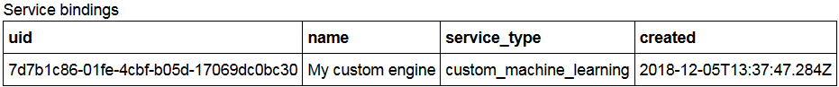

---

copyright:
  years: 2018
lastupdated: "2018-12-13"

---

{:shortdesc: .shortdesc}
{:new_window: target="_blank"}
{:tip: .tip}
{:important: .important}
{:note: .note}
{:pre: .pre}
{:codeblock: .codeblock}
{:screen: .screen}

# Payload logging for non-Watson Machine Learning service instances
{: #connect-ml}

If your AI model is deployed in a machine learning engine other than Watson Machine Learning (WML), you must enable payload logging for the external machine learning engine with a Python client.
{: shortdesc}

See more complete information in the [{{site.data.keyword.aios_short}} Python client documentation](http://ai-openscale-python-client.mybluemix.net/), and in the sample {{site.data.keyword.aios_short}} Python [client notebooks](https://github.com/pmservice/ai-openscale-sample-notebooks).

## Before you begin
{: #connect-prereq}

You will need to have the training data of your model available in Db2 or Cloud Object Storage to monitor bias for your model. Explainability and accuracy is not supported for Python functions.

- Import and initiate {{site.data.keyword.aios_short}}

    ```python
    from ibm_ai_openscale import APIClient

    aios_credentials = {
      "instance_guid": "***",
      "url": "https://api.aiopenscale.cloud.ibm.com",
      "apikey": "***"
    }

    client = APIClient(service_credentials)
    ```
  Credentials can be found by following the steps shown in the "[Creating credentials](creds.html)" topic.

- Create a schema name in your PostgreSQL database

- Set up a datamart

    ```python
    client.data_mart.setup(db_credentials=postgres_credentials, schema=schemaName)

    client.data_mart.get_details()
    ```

## Working with the Custom machine learning engine

### Bind your Custom machine learning engine

- A non-WML engine is bound as Custom, meaning that this is just metadata; there is no direct integration with the non-WML service.

    ```python
    custom_engine_credentials = {
    "url": "***",
    "username": "***",
    "password": "***"
    }

    binding_uid = client.data_mart.bindings.add('My custom engine', CustomMachineLearningInstance(custom_engine_credentials))

    bindings_details = client.data_mart.bindings.get_details()
    ```
  You can see your service binding with the following command:

    ```python
    client.data_mart.bindings.list()
    ```

    

### Add Custom subscription

- Add subscription

    ```python
    client.data_mart.subscriptions.add(CustomMachineLearningAsset(source_uid='action', binding_uid=binding_uid, prediction_column='predictedActionLabel'))
    ```

- Get subscription list

    ```python
    subscriptions = client.data_mart.subscriptions.get_details()

    subscriptions_uids = client.data_mart.subscriptions.get_uids()
    print(subscriptions_uids)
    ```

### Enable payload logging

- Enable payload logging in subscription

    ```python
    subscription.payload_logging.enable()
    ```

- Get logging details

    ```python
    subscription.payload_logging.get_details()
    ```

### Scoring and payload logging

- Score your model, then convert the request and response to the form used by {{site.data.keyword.aios_short}}. For a full example, see the [IBM AI OpenScale & Custom ML engine notebook](https://github.com/pmservice/ai-openscale-tutorials/blob/master/notebooks/AI%20OpenScale%20and%20Custom%20ML%20Engine.ipynb).

<!---
    ```python
    import urllib.request
    import json

    data = {
            {
             "input1":
             [
                {
                  <YOUR-JSON-DATA>
                }
             ],
            },
    }

    body = str.encode(json.dumps(data))

    url = '<YOUR-SERVICE-URL>'
    api_key = '<API-KEY-FOR-YOUR-WEB-SERVICE>'
    headers = {'Content-Type':'application/json', 'Authorization':('Bearer '+ api_key)}

    req = urllib.request.Request(url, body, headers)
    response = urllib.request.urlopen(req)

    result = response.read()
    result = json.loads(result.decode())['Results']['output1'][0]
    print(json.dumps(result, indent=2))
    ```
--->
- Store the request and response in the payload logging table

    ```python
    records_list = [PayloadRecord(request=request_data, response=response_data, response_time=response_time), PayloadRecord(request=request_data, response=response_data, response_time=response_time)]

    subscription.payload_logging.store(records=records_list)
    ```
    **Note**: For languages other than Python, you can also perform payload logging directly, using a REST API.

    ```json
    token_endpoint = "https://iam.bluemix.net/identity/token"
    headers = {
            "Content-Type": "application/x-www-form-urlencoded",
            "Accept": "application/json"
    }

    data = {
            "grant_type":"urn:ibm:params:oauth:grant-type:apikey",
            "apikey":aios_credentials["apikey"]
    }

    req = requests.post(token_endpoint, data=data, headers=headers)
    token = req.json()['access_token']
    ```

    ```json
    import requests, uuid

    PAYLOAD_STORING_HREF_PATTERN = '{}/v1/data_marts/{}/scoring_payloads'
    endpoint = PAYLOAD_STORING_HREF_PATTERN.format(aios_credentials['url'], aios_credentials['data_mart_id'])

    payload = [{
      'binding_id': binding_uid,
      'deployment_id': subscription.get_details()['entity']['deployments'][0]['deployment_id'],
      'subscription_id': subscription.uid,
      'scoring_id': str(uuid.uuid4()),
      'response': response_data,
      'request': request_data
    }]

    headers = {"Authorization": "Bearer " + token}
    req_response = requests.post(endpoint, json=payload, headers = headers)
    print("Request OK: " + str(req_response.ok))
    ```
<!---
## Bind your Microsoft Azure machine learning engine

ADDITIONAL INFO HERE.

<!---
- A non-WML engine is bound as `generic`, meaning that this is just metadata; there is no direct integration with the non-WML service.

    ```python
    binding_uid = client.data_mart.bindings.add('My non-WML instance', GenericMachineLearningInstance())

    bindings_details = client.data_mart.bindings.get_details()
    ```
  You can see your service binding with the following command:

    ```python
    client.data_mart.bindings.list()
    ```

    

## Add `generic` subscription

- Add subscription

    ```python
    client.data_mart.subscriptions.add(GenericAsset(name='Non-WML model deployment', binding_uid=binding_uid))
    ```

- Get subscription list

    ```python
    subscriptions = client.data_mart.subscriptions.get_details()

    subscriptions_uids = client.data_mart.subscriptions.get_uids()
    print(subscriptions_uids)
    ```

## Enable payload logging

- Enable payload logging in subscription

    ```python
    subscription.payload_logging.enable()
    ```

- Get logging details

    ```python
    subscription.payload_logging.get_details()
    ```

## Scoring and payload logging

- Score your model, then convert the request and response to the form used by {{site.data.keyword.aios_short}}. For an example, see the [IBM AI OpenScale & Microsoft Azure Machine Learning notebook](https://github.com/pmservice/ai-openscale-sample-notebooks/blob/master/Payload%20logging%20for%20MS%20Azure%20model.ipynb).

- Store the request and response in the payload logging table

    ```python
    subscription.payload_logging.store(request=request, response=response)
    ```
    **Note**: For languages other than Python, you can also perform payload logging directly, using a REST API.

    ```json
    token_endpoint = "https://iam.bluemix.net/identity/token"
    headers = {
            "Content-Type": "application/x-www-form-urlencoded",
            "Accept": "application/json"
    }

    data = {
            "grant_type":"urn:ibm:params:oauth:grant-type:apikey",
            "apikey":aios_credentials["apikey"]
    }

    req = requests.post(token_endpoint, data=data, headers=headers)
    token = req.json()['access_token']
    ```

    ```json
    import requests, uuid

    PAYLOAD_STORING_HREF_PATTERN = '{}/v1/data_marts/{}/scoring_payloads'
    endpoint = PAYLOAD_STORING_HREF_PATTERN.format(aios_credentials['url'], aios_credentials['data_mart_id'])

    payload = [{
      'binding_id': binding_uid, 
      'deployment_id': subscription.get_details()['entity']['deployments'][0]['deployment_id'], 
      'subscription_id': subscription.uid, 
      'scoring_id': str(uuid.uuid4()), 
      'response': response,
      'request': request
    }]

    headers = {"Authorization": "Bearer " + token}
    req_response = requests.post(endpoint, json=payload, headers = headers)
    print("Request OK: " + str(req_response.ok))
    ```

## Bind your Amazon SageMaker machine learning engine

ADDITIONAL INFO HERE.

- A non-WML engine is bound as `generic`, meaning that this is just metadata; there is no direct integration with the non-WML service.

    ```python
    binding_uid = client.data_mart.bindings.add('My non-WML instance', GenericMachineLearningInstance())

    bindings_details = client.data_mart.bindings.get_details()
    ```
  You can see your service binding with the following command:

    ```python
    client.data_mart.bindings.list()
    ```

    

## Add `generic` subscription

- Add subscription

    ```python
    client.data_mart.subscriptions.add(GenericAsset(name='Non-WML model deployment', binding_uid=binding_uid))
    ```

- Get subscription list

    ```python
    subscriptions = client.data_mart.subscriptions.get_details()

    subscriptions_uids = client.data_mart.subscriptions.get_uids()
    print(subscriptions_uids)
    ```

## Enable payload logging

- Enable payload logging in subscription

    ```python
    subscription.payload_logging.enable()
    ```

- Get logging details

    ```python
    subscription.payload_logging.get_details()
    ```

## Scoring and payload logging

- Score your model, then convert the request and response to the form used by {{site.data.keyword.aios_short}}. For an example, see the [IBM AI OpenScale & Microsoft Azure Machine Learning notebook](https://github.com/pmservice/ai-openscale-sample-notebooks/blob/master/Payload%20logging%20for%20MS%20Azure%20model.ipynb).

- Store the request and response in the payload logging table

    ```python
    subscription.payload_logging.store(request=request, response=response)
    ```
    **Note**: For languages other than Python, you can also perform payload logging directly, using a REST API.

    ```json
    token_endpoint = "https://iam.bluemix.net/identity/token"
    headers = {
            "Content-Type": "application/x-www-form-urlencoded",
            "Accept": "application/json"
    }

    data = {
            "grant_type":"urn:ibm:params:oauth:grant-type:apikey",
            "apikey":aios_credentials["apikey"]
    }

    req = requests.post(token_endpoint, data=data, headers=headers)
    token = req.json()['access_token']
    ```

    ```json
    import requests, uuid

    PAYLOAD_STORING_HREF_PATTERN = '{}/v1/data_marts/{}/scoring_payloads'
    endpoint = PAYLOAD_STORING_HREF_PATTERN.format(aios_credentials['url'], aios_credentials['data_mart_id'])

    payload = [{
      'binding_id': binding_uid, 
      'deployment_id': subscription.get_details()['entity']['deployments'][0]['deployment_id'], 
      'subscription_id': subscription.uid, 
      'scoring_id': str(uuid.uuid4()), 
      'response': response,
      'request': request
    }]

    headers = {"Authorization": "Bearer " + token}
    req_response = requests.post(endpoint, json=payload, headers = headers)
    print("Request OK: " + str(req_response.ok))
    ```
--->

## Next steps
{: #connect-next}

- To continue with the {{site.data.keyword.aios_short}} client, see the "[Specify your Watson Machine Learning service instance](connect-wml.html)" topic.

- To continue with the Python command library, refer to the [Python client documentation](http://ai-openscale-python-client.mybluemix.net/).
