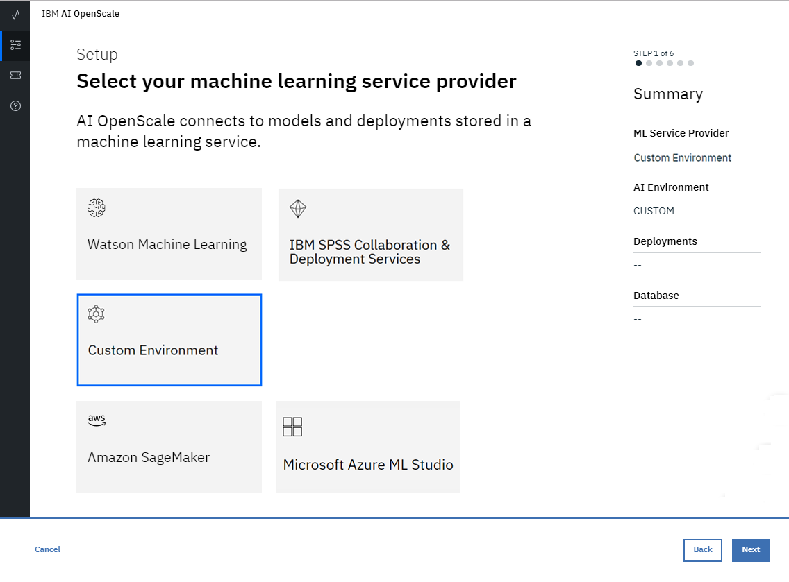
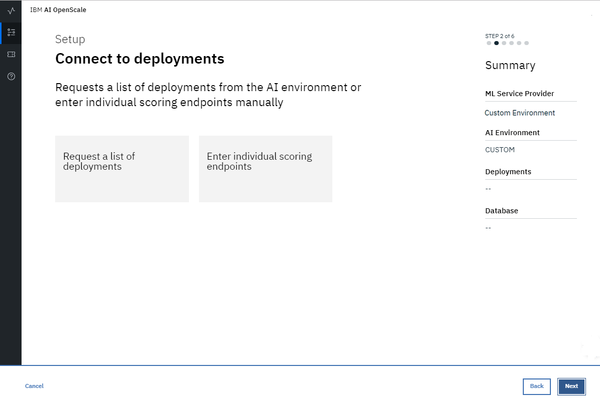
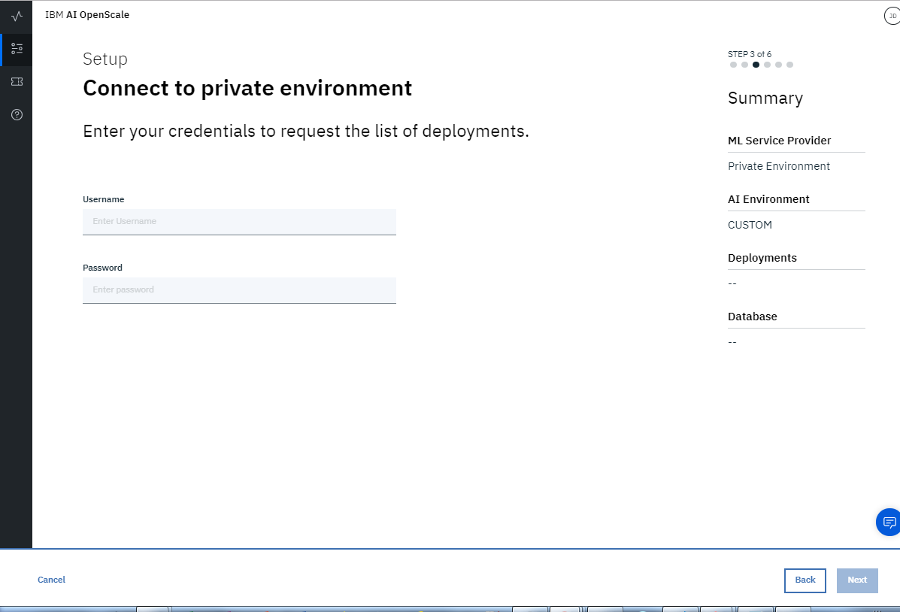
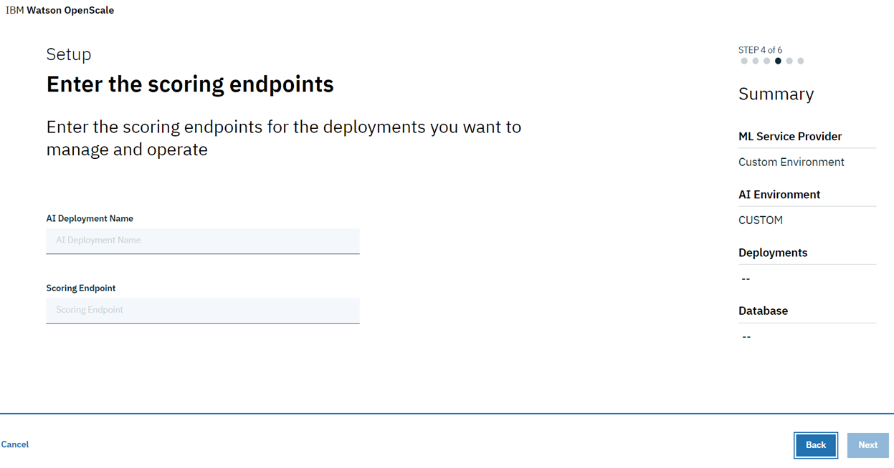
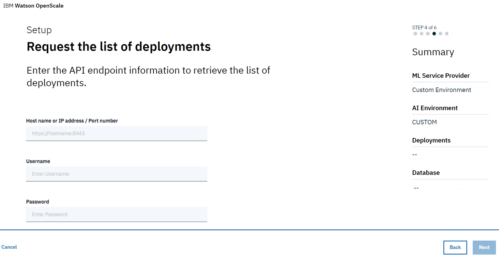
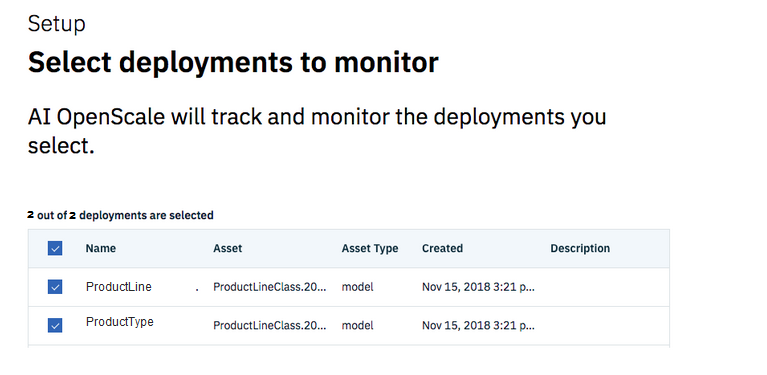
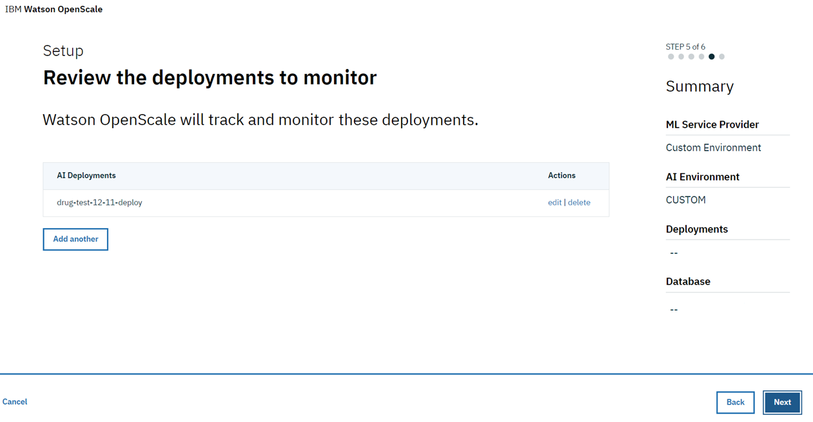
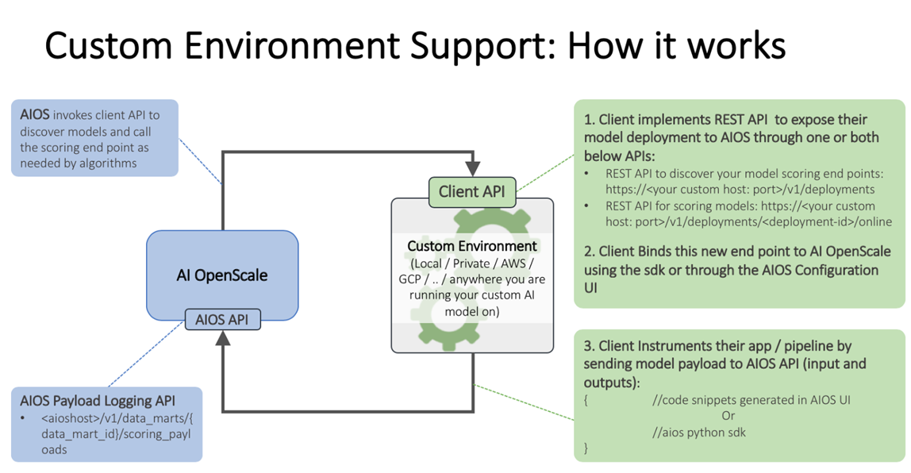

---

copyright:
  years: 2018
lastupdated: "2018-12-14"

---

{:shortdesc: .shortdesc}
{:new_window: target="_blank"}
{:tip: .tip}
{:important: .important}
{:note: .note}
{:pre: .pre}
{:codeblock: .codeblock}
{:screen: .screen}

# Specify your Custom service
{: #connect-other}

Your first step in the {{site.data.keyword.aios_short}} tool is to specify a service instance. Your service instance is where you store your AI models and deployments.
{: shortdesc}

## Connect your Custom service instance
{: #config-other}

{{site.data.keyword.aios_short}} connects to AI models and deployments in a service instance.

### Steps to configure

1.  From the home page of the {{site.data.keyword.aios_short}} tool, click **Begin**.

    

1.  Select the **Custom** tile and click **Next**.

    

1.  Connect to deployments by selecting one of the options:

    

1.  Enter your credentials:

    

1.  Click **Next**.

    - If you selected the "Enter individual scoring endpoints" tile, you must provide a deployment name and endpoint:

      

      Click **Next**.

    - If you selected the "Request a list of deployments" tile, you must provide a hostname or IP address, and port number:

      

      Click **Next**.

      Then select from the list of deployments:

      

1.  Review your selected deployments.

    

1.  Click **Next**.

### How it works
{: #custom-works}

This image shows the Custom environment support:



You can also reference the following links:

[AIOS payload logging API](https://console.bluemix.net/apidocs/ai-openscale#publish-scoring-payload)

[Custom deployment API](https://aiopenscale-custom-deployement-spec.mybluemix.net/)

[Python client binding SDK](http://ai-openscale-python-client.mybluemix.net/#bindings)

[AIOS configuration UI - sample code](https://github.com/pmservice/ai-openscale-tutorials/blob/master/notebooks/AI%20OpenScale%20and%20Custom%20ML%20Engine.ipynb)

[AIOS Python SDK](https://pypi.org/project/ibm-ai-openscale/)

- **Input criteria for model to support monitors**

  Your model should take as input a feature vector, which is essentially a collection of named fields and their values (the fields being monitored for bias being one of those fields):

  ```bash
  {
    "fields": [
        "name",
        "age",
        "position"
    ],
    "values": [
        [
            "john",
            33,
            "engineer"
        ],
        [
            "mike",
            23,
            "student"
        ]
    ]
  }
  ```

  In this example, `“age”` could be a field someone is evaluating for fairness.
  
  If the input is a tensor/matrix, which is transformed from the input feature space (which is often the case in deep learning from text or images), that model cannot be handled by the {{site.data.keyword.aios_short}} platform in the current release. By extension, deep learning models with text or image inputs cannot be handled for bias detection and mitigation.
  
  Additionally, training data should be loaded to support Explainability.
  
  For explainability on text, the full text should be one of the features. Explainability on images for a Custom model is not supported in the current release.
  {: note}

- **Output criteria for model to support monitors**

  Your model should output the input feature vector alongside the prediction probabilities of various classes in that model.

  ```bash
  {
    "fields": [
        "name",
        "age",
        "position",
        "prediction",
        "probability"
    ],
    "labels": [
        "personal",
        "camping"
    ],
    "values": [
        [
            "john",
            33,
            "engineer",
            "personal",
            [
                0.6744664422398081,
                0.3255335577601919
            ]
        ],
        [
            "mike",
            23,
            "student"
            "camping",
            [
                0.2794765664946941,
                0.7205234335053059
            ]
        ]
    ]
  }
  ```

  In this example, `"personal”` and `“camping”` are the possible classes, and the scores in each scoring output are assigned to both classes. If the prediction probabilities are missing, bias detection will work, but auto-debias will not.
  
  The above scoring output should be accessible from a live scoring endpoint which {{site.data.keyword.aios_short}} could call over REST. For AzureML, SageMaker, and WML, {{site.data.keyword.aios_short}} directly connects to the native scoring endpoints, (so you don’t have to worry about implementing the scoring spec)

### Next steps
{: #payload-logging}

{{site.data.keyword.aios_short}} is now ready for you to [specify your database](connect-db.html).
