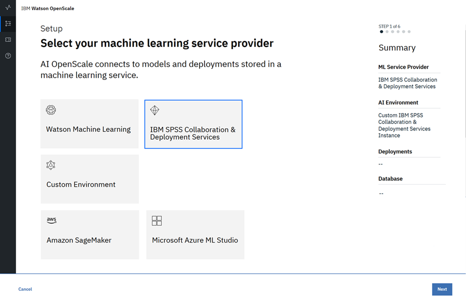
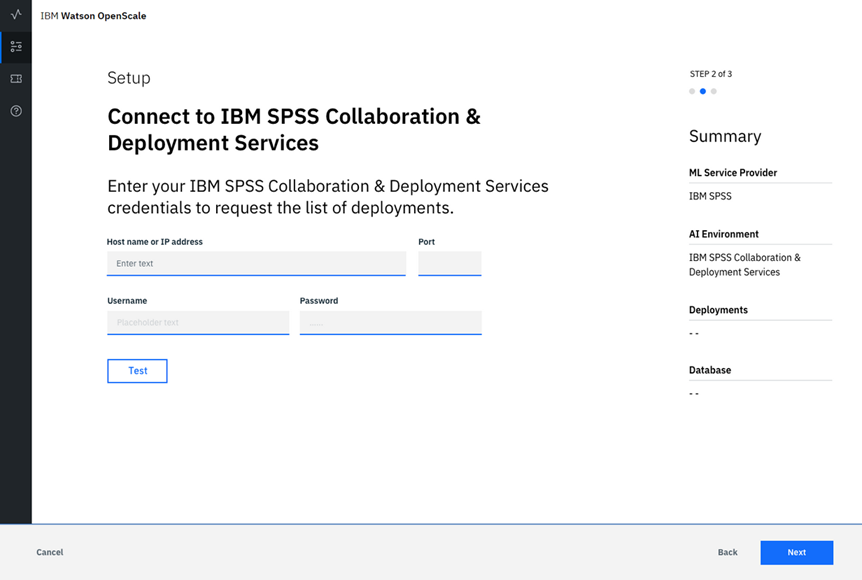
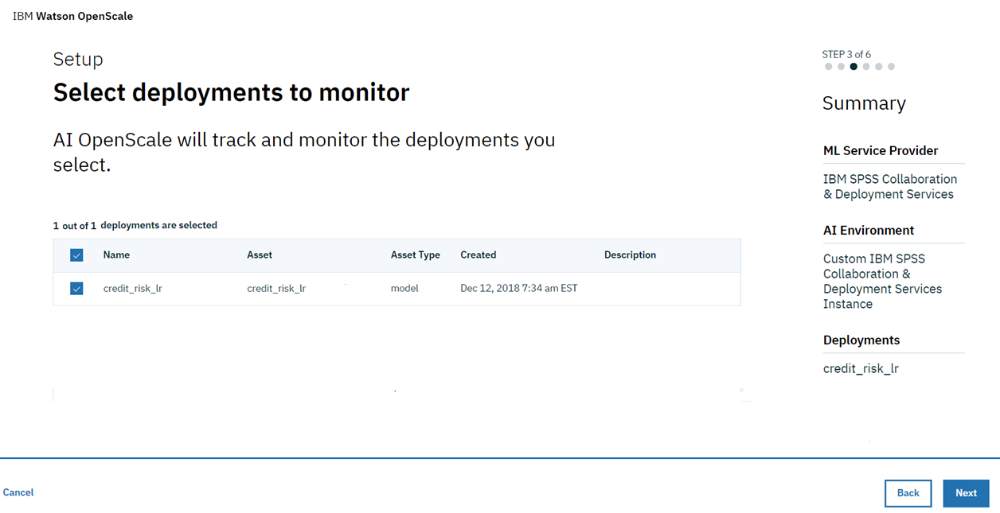

---

copyright:
  years: 2018, 2019
lastupdated: "2019-03-01"

---

{:shortdesc: .shortdesc}
{:new_window: target="_blank"}
{:tip: .tip}
{:important: .important}
{:note: .note}
{:pre: .pre}
{:codeblock: .codeblock}
{:screen: .screen}

# Specifying an IBM SPSS Collaboration & Deployment Services instance
{: #cspss-spss}

Your first step in the {{site.data.keyword.aios_short}} tool is to specify an IBM SPSS Collaboration & Deployment Services instance. Your SPSS Collaboration & Deployment Services instance is where you store your AI models and deployments.
{: shortdesc}

## Connect your IBM SPSS Collaboration & Deployment Services instance
{: #cspss-config}

{{site.data.keyword.aios_short}} connects to AI models and deployments in an IBM SPSS Collaboration & Deployment Services instance.

1.  From the home page of the {{site.data.keyword.aios_short}} tool, click **Begin**.

    

1.  Select the **IBM SPSS Collaboration & Deployment Services** tile and click **Next**.

    

1.  Enter your credentials.

    

1.  Click **Next**.

1.  {{site.data.keyword.aios_short}} will list your deployed models; select the ones you want to monitor

    

1.  Click **Next**.

## Next steps
{: #cspss-next}

{{site.data.keyword.aios_short}} is now ready for you to [specify your database](/docs/services/ai-openscale-icp?topic=ai-openscale-icp-cdb-connect).
