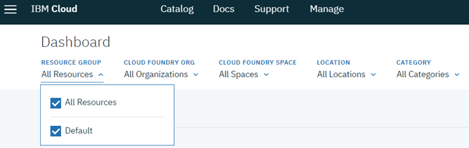

---

copyright:
  years: 2018, 2019
lastupdated: "2019-02-04"

---

{:shortdesc: .shortdesc}
{:new_window: target="_blank"}
{:tip: .tip}
{:pre: .pre}
{:codeblock: .codeblock}
{:screen: .screen}
{:javascript: .ph data-hd-programlang='javascript'}
{:java: .ph data-hd-programlang='java'}
{:python: .ph data-hd-programlang='python'}
{:swift: .ph data-hd-programlang='swift'}

# Creating credentials
{: #cred-creds}

To create credentials for {{site.data.keyword.aios_short}}, complete the following steps using the {{site.data.keyword.Bluemix_notm}} [command console](https://{DomainName}/docs/cli/index.html#overview):

- Get your API key

    ```curl
    ibmcloud login --sso
    ibmcloud iam api-key-create 'my_key'
    ```

    You will see information output like the following:

    ```bash
    Name         my_key
    Created At   2018-10-09T14:04+0000
    API Key      Tg4Gxxxxxxxxxxxxxxxxx_xxxxxxxxxxxxxxxxxQU-nE
    Locked       false
    UUID         ApiKey-xxxxxxxxx-afd7-xxxxx-b0e1-xxxxxxxxxxx
    ```
- Verify the Resource Group you are using in your {{site.data.keyword.Bluemix_notm}} account.

  

  If you are not using the `Default` resource group, then run the following command to get your credential for {{site.data.keyword.aios_short}}:

   ```curl
   ibmcloud target -g myResourceGroup
   ```

  where `myResourceGroup` is the name of the resource group associated with your {{site.data.keyword.aios_short}} instance.

- Get your {{site.data.keyword.aios_short}} instance ID

    ```curl
    ibmcloud resource service-instance '<Your_AI_OpenScale_instance_name>'
    ```
    **Note**: If you are using the {{site.data.keyword.Bluemix_notm}} command console on Windows, replace the single quotes (') in the above commands with double quotes (").

    You will see information output like the following:

    ```bash
    Name:                  AI OpenScale-my_instance
    ID:                    crn:v1:bluemix:public:aiopenscale:us-south:a/c2f2xxxxxxxxxxxx867::
    GUID:                  03daxxxx-xxxx-xxxx-xxxx-xxxxxxxx38a7
    Location:              us-south
    Service Name:          aiopenscale
    Service Plan Name:     lite
    Resource Group Name:   Default
    State:                 active
    Type:                  service_instance
    Sub Type:
    Tags:
    Created at:            2018-09-17T13:58:43Z
    Updated at:
    ```

    The `GUID` value is your {{site.data.keyword.aios_short}} instance ID.