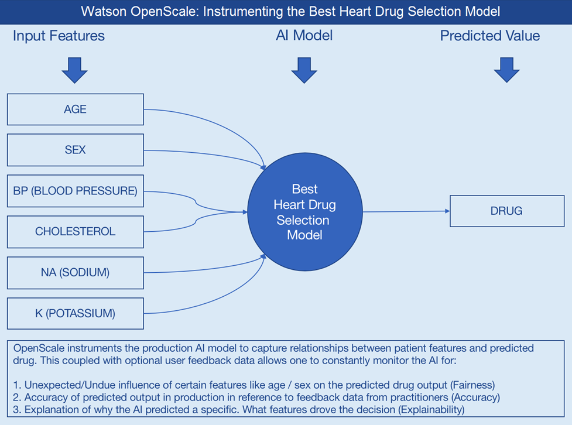
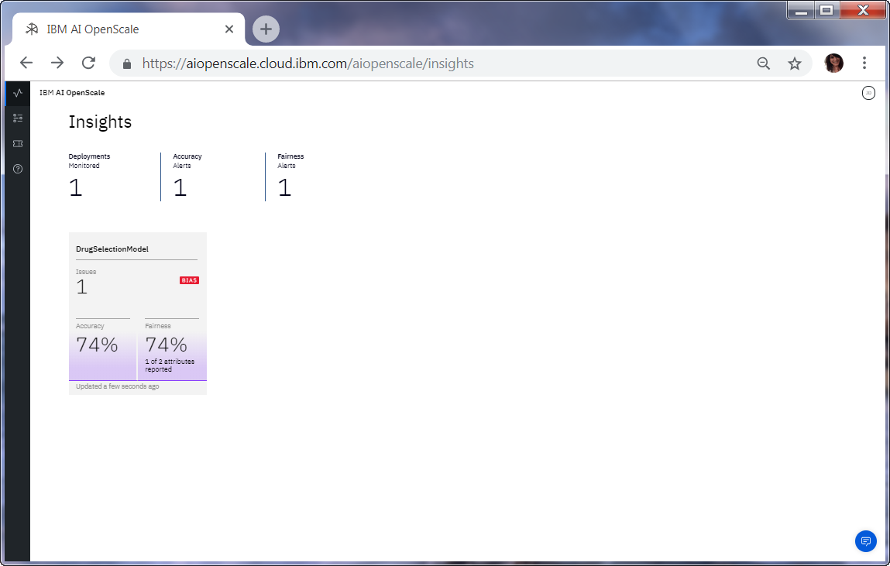
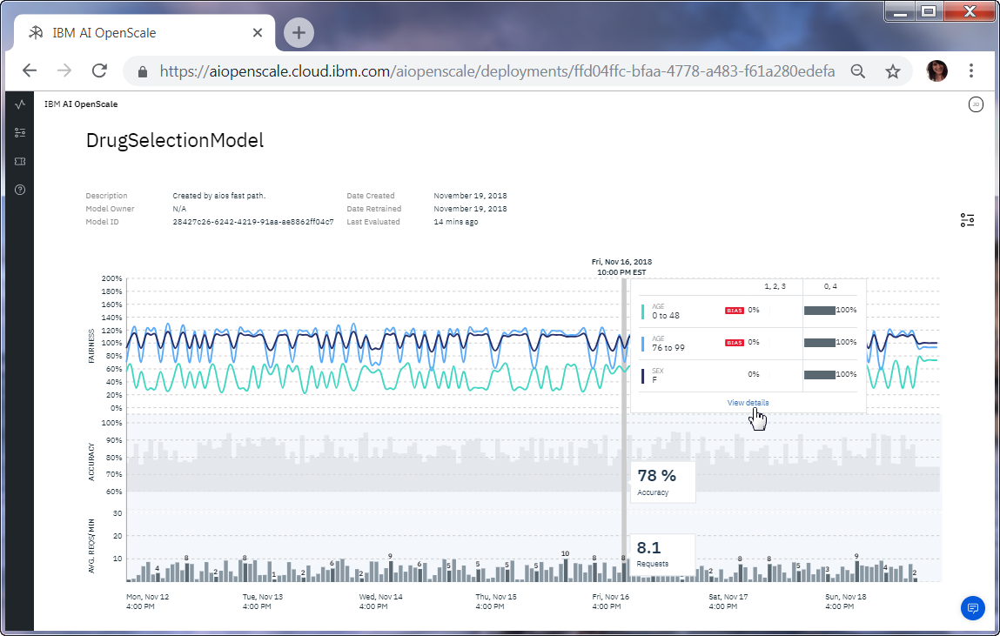
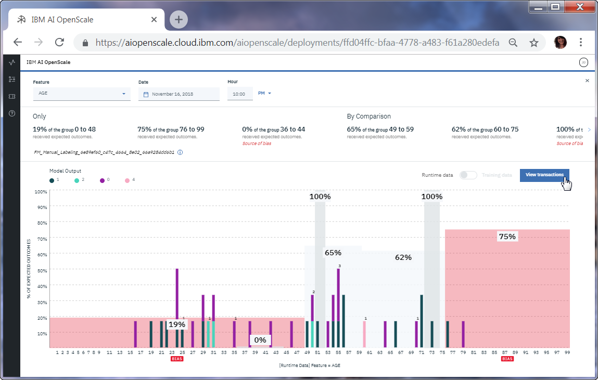
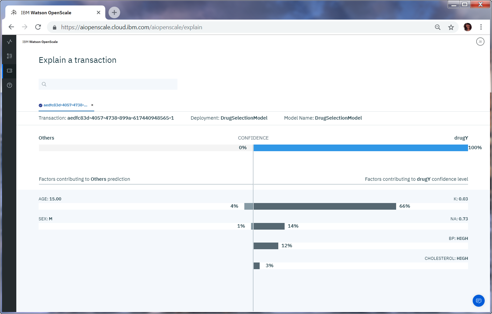

---

title: Trust and transparency for your machine learning models with AI OpenScale
description: Monitor your machine learning deployments for bias, accuracy, and explainability
duration: 120
intro: In this tutorial, you will provision IBM Cloud machine learning and data services, create and deploy machine learning models in Watson studio, and configure the new IBM AI OpenScale product to monitor your models for trust and transparency.
takeaways:
- See how AI OpenScale provides trust and transparency for AI models
- Understand how IBM Cloud services and Watson Studio technologies can provide a seamless, AI-driven customer experience

copyright:
  years: 2018
lastupdated: "2018-12-18"

---

{:shortdesc: .shortdesc}
{:new_window: target="_blank"}
{:hide-dashboard: .hide-dashboard}
{:tip: .tip}
{:important: .important}
{:note: .note}
{:pre: .pre}
{:codeblock: .codeblock}
{:screen: .screen}
{:javascript: .ph data-hd-programlang='javascript'}
{:java: .ph data-hd-programlang='java'}
{:python: .ph data-hd-programlang='python'}
{:swift: .ph data-hd-programlang='swift'}

# Getting started
{: #gettingstarted}

{{site.data.keyword.aios_full}} allows enterprises to automate and operationalize AI lifecycle in business applications, ensuring AI models are free from bias, can be easily explained and understood by business users, and are auditable in business transactions. {{site.data.keyword.aios_short}} supports AI models built and run in the tools and model serve frameworks of your choice.
{: shortdesc}

## Overview
{: #gs-view-demo}

Get a quick overview of {{site.data.keyword.aios_short}} by watching this video.

<p>
  <div class="embed-responsive embed-responsive-16by9">
    <iframe class="embed-responsive-item" id="youtubeplayer" title="Trust and Transparency in AI" type="text/html" width="640" height="390" src="https://www.youtube.com/embed/6Ei8rPVtCf8" frameborder="0" webkitallowfullscreen mozallowfullscreen allowfullscreen> </iframe>
  </div>
</p>

## Use case and the value of {{site.data.keyword.aios_short}}

A biomedical company that produces heart drugs has collected data about a set of patients, all of whom suffered from the same illness. During their course of treatment, each patient responded to one of four medications. The company is using this data to build an AI assistant for medical practitioners, which will recommend the drug it believes to be the best choice for the patient.

The model uses patient data fields AGE, SEX, BP (blood pressure), CHOLESTEROL, K (potassium levels), and NA (sodium levels) to predict one of four values for the DRUG data field.

  

### How {{site.data.keyword.aios_short}} can help

- *Identify run-time bias in the model*: The company has established evidence that shows the key factors that should influence which drug is predicted are BP, CHOLESTEROL, K and NA. AGE and SEX do play a role, but they're not as significant when compared to the other indicators. The company suspects that the data coming from patient trials might have suffered from biases of the practitioners for prescribing medications based on SEX and BP. The company wants to constantly monitor for such biases being learned from the data, and flag a suspected bias.

- *Constantly validate the accuracy of the model*: The company routinely evaluates the model prediction by having experts provide their own drug recommendations based on the patient data. The goal is to integrate these manual evaluations as feedback, to tell the model in real time where it might be wrong, and improve it over time.

- *Make the model more trustworthy*: To achieve a successful adoption of its AI assistant, the company received feedback from its customer base of medical practitioners and doctors who said they would not trust the AI model recommendations without understanding the logic behind them.

Each of these issues will be addressed through the use of {{site.data.keyword.aios_short}}:

- The Fairness monitor will flag SEX and BP biases the model may have
- The Accuracy monitor uses feedback generated by your experts to test the performance of the deployed model, to detect model drift

## Automated setup
{: #module}

To quickly see how {{site.data.keyword.aios_short}} monitors a model, technical users can install a Python module that automates the configuration of {{site.data.keyword.aios_short}} and other services. Sample data is included.

## Before you begin
{: #prereqs}

1. [Install {{site.data.keyword.aios_short}} into {{site.data.keyword.icpfull}} for Data](/docs/services/ai-openscale-icp/install-icp.html).
2. [Install any release of Python 3 ](https://www.python.org/downloads/){: new_window}.

   **Note**: Python 3 includes the required pip package management system.

3. Install the `ibm-ai-openscale-cli` package by running the following command:

    ```
    pip install -U ibm-ai-openscale-cli
    ```
    {: codeblock}

## Running the module
{: #run}

Run the command with the following required arguments, substituting the necessary information as indicated:

```
ibm-ai-openscale-cli --apikey None --db2 <path to IBM DB2 credentials file> --env icp --username <admin> --password <password> --url https://<IP address of host ICP for Data installation>:31843
```
{: codeblock}

Regarding the optional `--datamart-name <datamart name>` argument, when you run the module, it creates a `datamart-name` value called `aiosfastpath`, which is a schema that must be reserved exclusively for use by {{site.data.keyword.aios_short}}. If you rerun the module, it programmatically deletes and recreates the `datamart-name` schema, so you can't use the schema for any other purpose.
{: note}

### Example of IBM DB2 credentials file

Your IBM DB2 credentials file might look something like the following `db2-vcap.json` file:

```
{
  "db_type": "db2",
  "hostname": "<DB2 IP address>",
  "password": "<your password>",
  "port": 50000,
  "db": "FASTPATH",
  "username": "<DB2 user name>",
  "url": "<Address to of DB2 on your system>"
}
```
{: codeblock}

## Viewing results in {{site.data.keyword.aios_short}}
{: #open}

To view insights into the fairness and accuracy of the model, details of data that is monitored, and explainability for an individual transaction, open the {{site.data.keyword.aios_short}} dashboard.

### View insights
{: #insights}

From the {{site.data.keyword.aios_short}} dashboard click the **Insights** tab, which shows an overview of metrics for deployed models: 

- At a glance, the Insights page shows any issues with fairness and accuracy, as determined by the thresholds that are configured.

- Each deployment is shown as a tile. The module configured a deployment called `DrugSelectionModel`, as shown in the following screen capture:

  

### View monitoring data
{: #monitoring}

1.  From the Insights page, click the `DrugSelectionModel` tile to view details about the monitored data.
1.  Slide the marker across the chart to view a day and time period that show data and then click the **View details** link.

     - For example, the following screen shows data for a specific date and time. The dates and times vary, depending on when you run the module.

     - For information about interpreting the time series chart, see [Working with monitored data > Monitoring Fairness, Average Requests per Minute, and Accuracy](/docs/services/ai-openscale-icp/insight-timechart.html#insight-time-chart).

      

1.  From the **Feature** menu, ensure that `AGE` is selected to see details about  `AGE` data monitoring.

    - Notice that in the following screen capture, the source of the bias is for the age group `36 to 44`.

    - The next section describes how to view the factors that contribute to bias.

    - For information about interpreting the visualization of the data points at a specifc hour, see [Working with monitored data > Data visualization](/docs/services/ai-openscale-icp/insight-timechart.html#insight-data-visual).

      

### View explainability
{: #explain}

1.  To understand the factors that contribute when bias is present for a given time period, from the visualization screen shown in the previous section, select the **View transactions** button.

    Transaction IDs for the past hour are listed.

1.  Copy one of the transaction IDs.

    

1.  Click the **Explainability** tab: 

    The "Explain a transaction" page is shown.

1.  Paste the copied transaction ID into the search box and press the Enter key on your keyboard.

    - The page shows how the model arrived at its conclusion, including how confident the model is, the factors that contribute to the confidence level, and the attributes that were fed to the model.

    - For information about interpreting transaction explainability, see [Working with monitored data > Monitoring Explainability](/docs/services/ai-openscale-icp/insight-timechart.html#insight-explain).

      

## Related information
{: #info}

- To learn about biases, see [Fairness](/docs/services/ai-openscale-icp/monitor-fairness.html).
- To learn about how well your model predicts outcomes, see [Accuracy](/docs/services/ai-openscale-icp/monitor-accuracy.html).
- To learn about interpreting charts, data, and transactions, see [Working with monitored data](/docs/services/ai-openscale-icp/insight-timechart.html).
