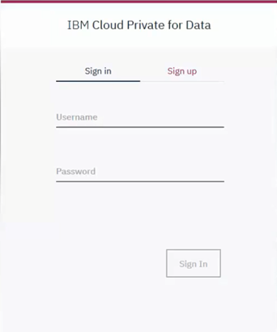
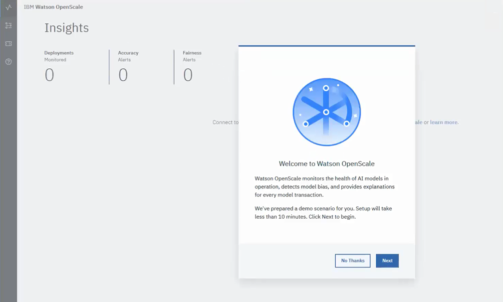
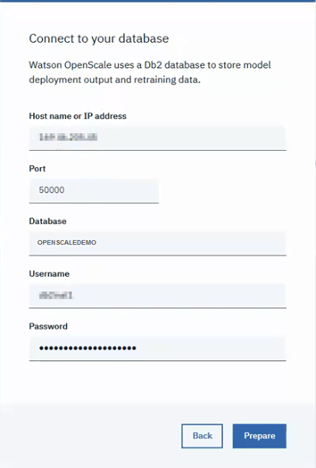
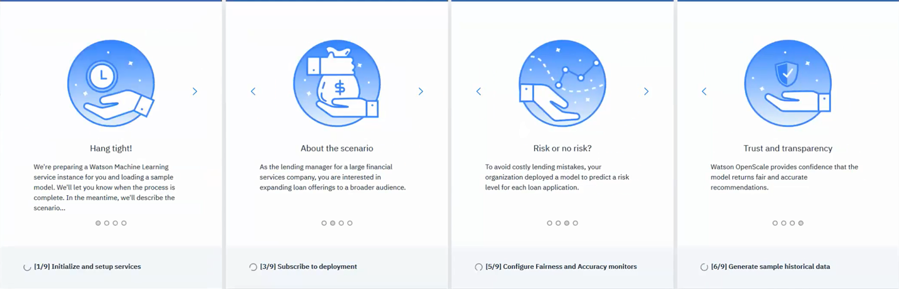
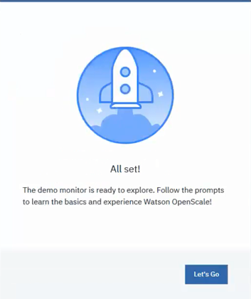
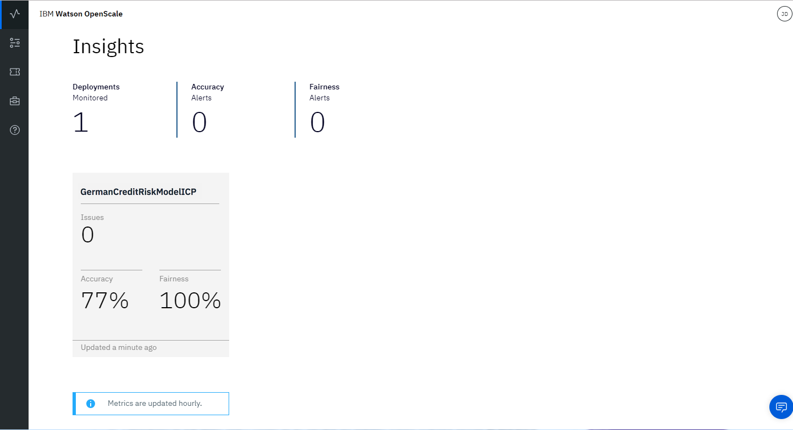
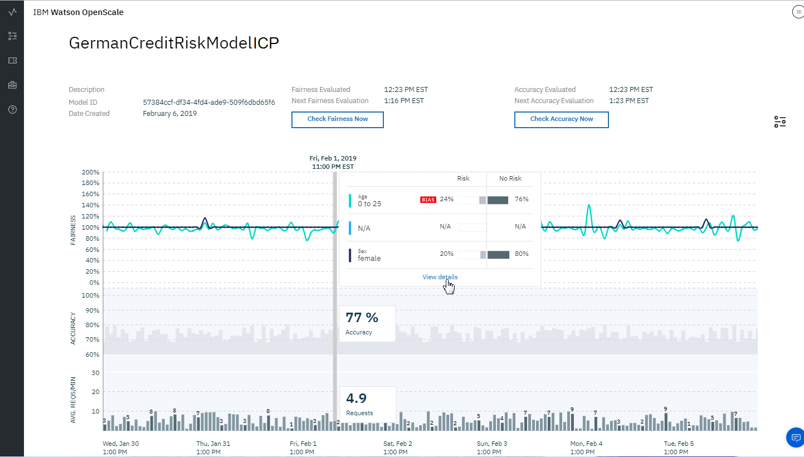
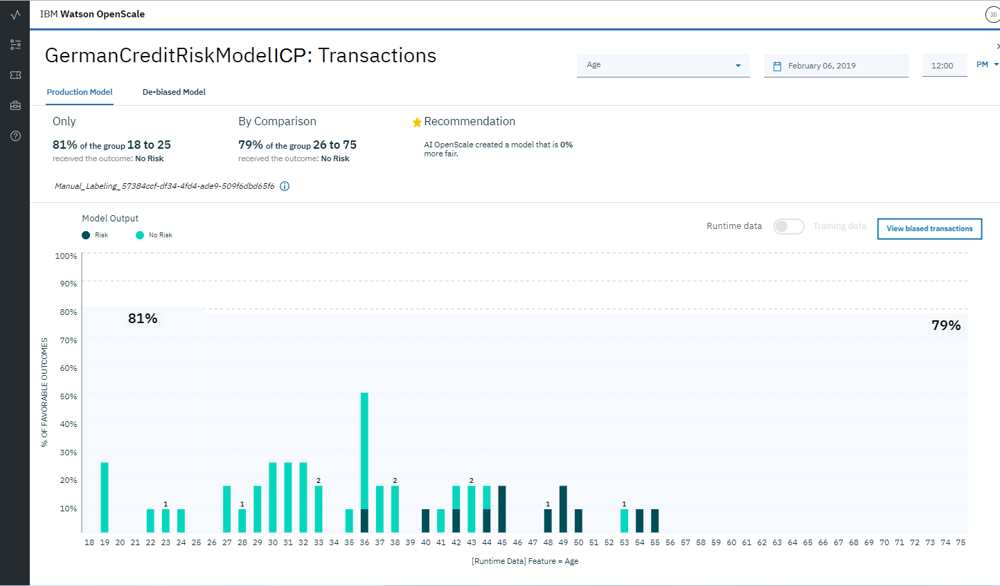

---

copyright:
  years: 2018, 2019
lastupdated: "2019-04-15"

---

{:shortdesc: .shortdesc}
{:new_window: target="_blank"}
{:hide-dashboard: .hide-dashboard}
{:tip: .tip}
{:important: .important}
{:note: .note}
{:pre: .pre}
{:codeblock: .codeblock}
{:screen: .screen}
{:javascript: .ph data-hd-programlang='javascript'}
{:java: .ph data-hd-programlang='java'}
{:python: .ph data-hd-programlang='python'}
{:swift: .ph data-hd-programlang='swift'}

# Getting started
{: #gs-get-started}

{{site.data.keyword.aios_full}} allows enterprises to automate and operationalize AI lifecycle in business applications, ensuring AI models are free from bias, can be easily explained and understood by business users, and are auditable in business transactions. {{site.data.keyword.aios_short}} supports AI models built and run in the tools and model serve frameworks of your choice.
{: shortdesc}

## Overview
{: #gs-demo}

Get a quick overview of {{site.data.keyword.aios_short}} by watching this video.

<p>
  <div class="embed-responsive embed-responsive-16by9">
    <iframe class="embed-responsive-item" id="youtubeplayer" title="Trust and Transparency in AI" type="text/html" width="640" height="390" src="https://www.youtube.com/embed/6Ei8rPVtCf8" frameborder="0" webkitallowfullscreen mozallowfullscreen allowfullscreen> </iframe>
  </div>
</p>

## Automated setup
{: #gs-module}

To quickly see how {{site.data.keyword.aios_short}} monitors a model, run the demo scenario option that is provided when you first log into the {{site.data.keyword.aios_short}} UI.  See [Working with the UI demo](#gs-work-demo).

Technical users can choose to install a Python module that automates the configuration of {{site.data.keyword.aios_short}} and other services, and provides sample data. See [Running the Python module](#gs-run).

Additional tutorial links may be found in the [Additional resources](/docs/services/ai-openscale-icp?topic=ai-openscale-icp-arsc-ov) topic.

## Working with the UI demo
{: #gs-work-demo}

1.  Sign into your {{site.data.keyword.aios_short}} instance on {{site.data.keyword.icpfull}} for Data.

    

1.  To work with the demo scenario, select **Next**.

    

1.  Now, provide the Host name/IP address, Port, Username, and Password for your Db2 database. Create a Database name for the demo, then click **Prepare**.

    

As the {{site.data.keyword.aios_short}} services are being provisioned, you can review the demo scenario:

  

When provisioning is complete, select **Let's Go** to exit to the {{site.data.keyword.aios_short}} dashboard, and then proceed with [Viewing results in {{site.data.keyword.aios_short}}](#gs-open) below.

  

## Running the Python module
{: #gs-run}

### Before you begin
{: #gs-prereqs}

1.  [Install {{site.data.keyword.aios_short}} into {{site.data.keyword.icpfull}} for Data](/docs/services/ai-openscale-icp?topic=ai-openscale-icp-inst-install-icp).
1.  [Install any release of Python 3 ](https://www.python.org/downloads/){: new_window}.

    Python 3 includes the required pip package management system.
    {: note}

1.  Install the `ibm-ai-openscale-cli` package by running the following command:

    ```bash
    pip install -U ibm-ai-openscale-cli
    ```
    {: codeblock}

### Run the command
{: #gs-command}

If you have previously run this Python module, be aware that running it again will create new tables and override any previous data in the `AIOSFASTPATHICP` schema. To clear the schema manually, see [Delete sample database and schemas](#gs-cleanup) below.
{: note}

Run the command with the following required arguments, substituting the necessary information as indicated:

```bash
ibm-ai-openscale-cli --apikey None --db2 <path to IBM DB2 credentials file> --env icp --username <admin> --password <password> --url https://<IP address of host ICP for Data installation>:31843
```
{: codeblock}

Regarding the optional `--datamart-name <datamart name>` argument, when you run the module, it creates a `datamart-name` value called `aiosfastpath`, which is a schema that must be reserved exclusively for use by {{site.data.keyword.aios_short}}. If you rerun the module, it programmatically deletes and recreates the `datamart-name` schema, so you can't use the schema for any other purpose.
{: note}

To successfully run the module, the value of several Db2 parameters must be changed. Run the following commands from your Db2 database environment command window for Db2 organized **_by row_**:

```bash
db2 connect to [dbname] user [db username] using [db password]
```

```bash
db2 update db cfg for [dbname] using SELF_TUNING_MEM ON
```

```bash
db2 update db cfg for [dbname] using SORTHEAP 1024 AUTOMATIC
```

```bash
db2 update db cfg for [dbname] using SHEAPTHRES_SHR 5000 AUTOMATIC
```

```bash
db2 update db cfg for [dbname] using LOGFILSIZ 5000
```

Run the following commands from your Db2 database environment command window for Db2 organized **_by column_**:

```bash
db2  AUTOCONFIGURE APPLY DB AND DBM
```
{: important}

### Example of IBM DB2 credentials file

Your IBM DB2 credentials file might look something like the following `db2-vcap.json` file:

```bash
{
  "hostname": "<DB2 IP address>",
  "password": "<your password>",
  "port": 50000,
  "db": "FASTPATH",
  "username": "<DB2 user name>"
}
```
{: codeblock}

## Viewing results in {{site.data.keyword.aios_short}}
{: #gs-open}

To view insights into the fairness and accuracy of the model, details of data that is monitored, and explainability for an individual transaction, open the {{site.data.keyword.aios_short}} dashboard.

### View insights
{: #gs-insights}

From the {{site.data.keyword.aios_short}} dashboard click the **Insights** tab, which shows an overview of metrics for deployed models: 

- At a glance, the Insights page shows any issues with fairness and accuracy, as determined by the thresholds that are configured.

- Each deployment is shown as a tile. The module configured a deployment called `GermanCreditRiskModelICP`, as shown in the following screen capture:

  

### View monitoring data
{: #gs-monitoring}

1.  From the Insights page, click the `GermanCreditRiskModelICP` tile to view details about the monitored data.
1.  Click and drag the marker across the chart to view a day and time period that shows data and then click the **View details** link. Alternatively, you can click different time periods in the chart to change the data that you see.

     - For example, the following screen shows data for a specific date and time. The dates and times vary, depending on when you run the module.

     - For information about interpreting the time series chart, see [Monitoring Fairness, Average Requests per Minute, and Accuracy](/docs/services/ai-openscale-icp?topic=ai-openscale-icp-itc-timechart).

      

1.  To see details about `AGE` data monitoring, ensure that `AGE` is selected from the drop-down menu.

    - Notice that in the following screen capture, no bias exists.

    - For information about interpreting the chart of the data points at a specific hour, see [Data visualization](/docs/services/ai-openscale-icp?topic=ai-openscale-icp-itc-timechart#itc-data-visual).

      

### View explainability
{: #gs-explain}

To understand the factors that contribute when bias is present for a given time period, from the visualization screen shown in the previous section, select the **View biased transactions** button.

Transaction IDs for the past hour are listed for those transactions that have bias. For the model used in this module, no bias exists for requests that are available. Therefore, no transactions are shown for the time period in the following screen capture.

  

For information about finding and explaining transactions, see [Monitoring explainability](/docs/services/ai-openscale-icp?topic=ai-openscale-icp-ie-ov).

## Delete sample database and schemas
{: #gs-cleanup}

To delete the sample database and its schemas, run the following command:

```bash
ibm-ai-openscale-cli -i <iam-token> --datamart-reset --datamart-name <datamart name>
```

## Related information
{: #gs-info}

- To learn about biases, see [Fairness](/docs/services/ai-openscale-icp?topic=ai-openscale-icp-mf-monitor).
- To learn about how well your model predicts outcomes, see [Accuracy](/docs/services/ai-openscale-icp?topic=ai-openscale-icp-acc-monitor).
- To learn about interpreting charts, data, and transactions, see [Monitoring Fairness, Average Requests per Minute, and Accuracy](/docs/services/ai-openscale-icp?topic=ai-openscale-icp-itc-timechart).
