---

copyright:
  years: 2018
lastupdated: "2018-12-14"

---

{:shortdesc: .shortdesc}
{:new_window: target="_blank"}
{:tip: .tip}
{:important: .important}
{:note: .note}
{:pre: .pre}
{:codeblock: .codeblock}
{:screen: .screen}

# Monitoring fairness, accuracy, and explainability
{: #insight-deploy-detail}

Select a deployment from the dashboard to see monitoring data for that deployment.
{: shortdesc}

## Monitoring Fairness, Average Requests per Minute, and Accuracy
{: #insight-time-chart}

Monitoring data for individual deployments are displayed in a time series chart. The chart tracks Fairness, Average Requests per Minute, and Accuracy over the last seven days.

  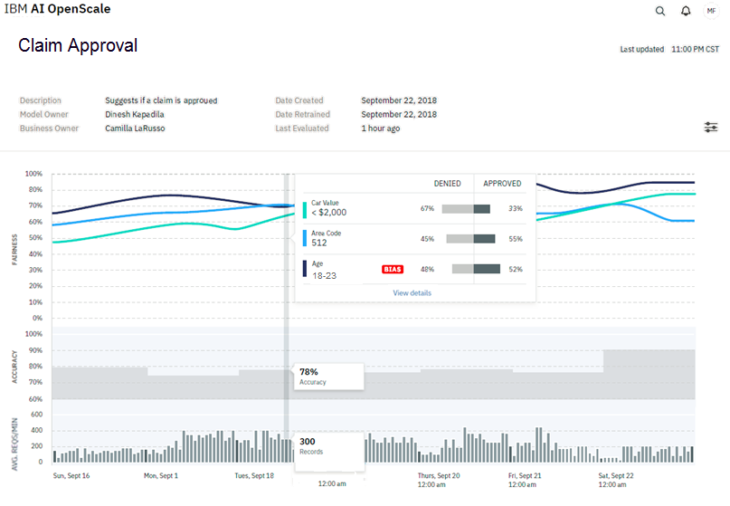

Move the marker across the chart to see statistics for an individual hour. In this example, the time selected is 1:00 PM CST on September 18, which reveals the following statistics:

  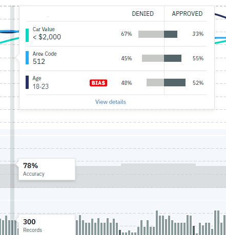

- ***Fairness***: Two of three Fairness features, Car Value and Area Code, met their set thresholds for approval. The third Fairness feature, Age, was flagged for bias. You can also see the number of expected outcomes (in this case percentages Approved vs. Denied) for an individual population in the features monitored for fairness.
- ***Accuracy***: The Accuracy metric averaged 78%.
- ***Avg. Reqs/Min***: On average, 300 records were processed per minute between 1:00 and 2:00 PM CST. The throughput is computed every minute, and its average value over the course of the hour is reported in the chart.

Select the chart to see details behind a particular Fairness statistic.

### Data visualization
{: #insight-data-visual}

Clicking the chart opens a visualization of the data points for a monitored feature at a specific hour. Following the previous example, the Age feature, which has been tagged for bias, is shown.

  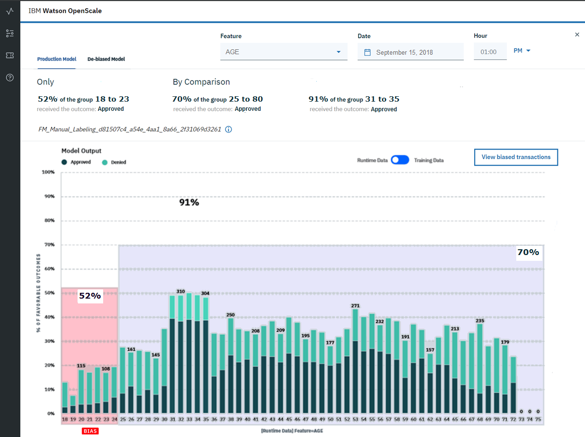

Note the three filters at the top of the page (Feature, Date, and Hour) that let you select a different feature or time to review details. This chart is showing multiple things:

- You can observe the population experiencing bias (customers between 18 and 23 years old). The chart also shows the percentage of expected outcome (52%) for this population.

- The chart shows the percentage of expected outcome (70%) for the reference population. This is the average of expected outcome across all reference populations.

- The chart is indicating the presence of bias, because the ratio of percentage of expected outcomes for populations age 18 to 23 years old to the percentage of expected outcomes for the reference population is below the threshold. In other words, 0.52/0.7 = 0.74, which is less than the 0.8 threshold.

- The chart also shows the distribution of the reference and monitored values for each distinct value of the attribute in the data from the payload table which was analyzed to identify bias. In other words, if the bias detection algorithm analyzed the last 1790 records from the payload table, then 120 of those records had customer age between 18 and 23, and out of that distribution the `Approved` and `Denied` outcomes are represented by the bar chart. The distribution of the payload data is shown for each distinct value of the fairness attribute (even reference values are shown). This information can be used to correlate the bias with the amount of data received by the model.

- The chart additionally shows that the population with ages between 31 and 35 years received 91% expected outcomes. This signifies the source of the bias, which means that data in this group skewed the results, and led to an increase in the percentage of expected outcomes for the reference class. This information can be used to identify parts of the data which can then be under-sampled when retraining the model.

- Another important thing that the chart shows is the name of the table containing the data which has been identified for manual labeling. Whenever the algorithm detects bias in a model, it also identifies the data points which can be sent for manual labeling by humans. This manually-labeled data can then be used along with the original training data to retrain the model. This retrained model is likely to not have the bias. The manual labeling table is present in the database associated with the {{site.data.keyword.aios_short}} instance.

- *Runtime and Training Data*

  The Runtime data / Training data switch lets you toggle the differences between your trained model and the data collected at runtime that is triggering a bias warning.

  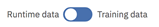

- *View Transactions*

  This option allows you to view the individual transactions that contributed to bias. When you click this link:

  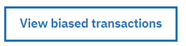

  a list of transactions for the past hour is listed.

  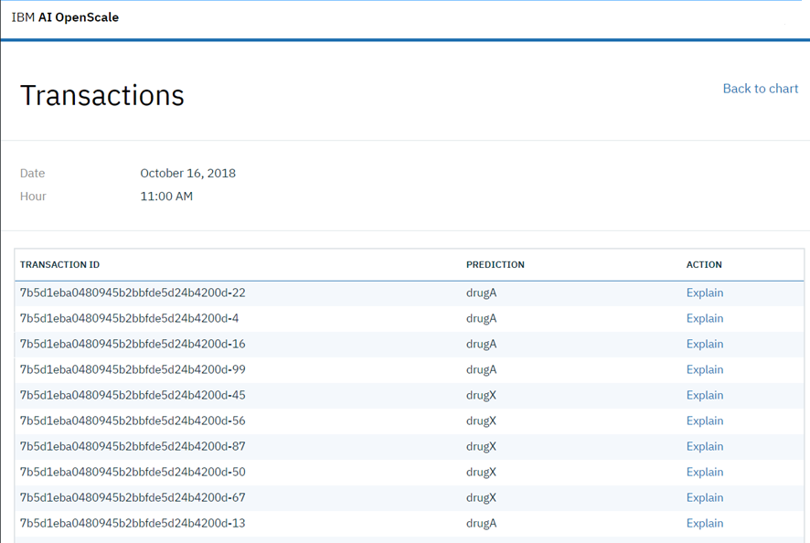

  Click any of the transaction IDs to get details about that transaction in the Explainability tab. See [Monitoring Explainability](insight-timechart.html#insight-explain) below.

- *Production model and De-biased model*

  You can use these two tabs to toggle between your production model, and a de-biased model created by {{site.data.keyword.aios_short}}.
  
  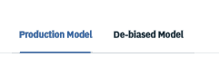

  Selecting the **De-biased model** tab will show you the changes in the de-biased model, versus the model in production. In this example, the model Fairness has increased from 74% to 93%, with a drop of only 1% in Accuracy. The chart also reflects the improved outcome status for groups aged 18 to 23.

   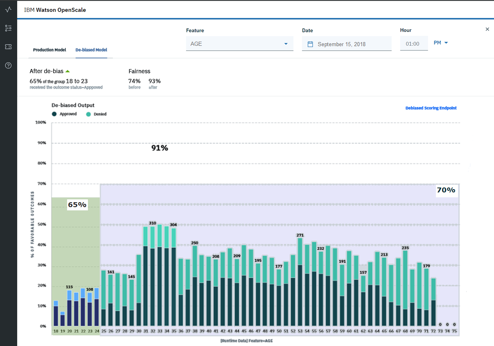

    - *Passive de-biasing* - When {{site.data.keyword.aios_short}} does bias checking, it also does a de-biasing of the data, by analyzing the behavior of the model, and identifying the data where the model is acting in a biased manner.

      {{site.data.keyword.aios_short}} then builds a machine learning model to predict whether the model is likely to act in a biased manner on a given, new data point. {{site.data.keyword.aios_short}} then analyzes the data which is received by the model, on an hourly basis, and finds the data points where {{site.data.keyword.aios_short}} believes the model is acting in a biased manner. For such data points, the fairness attribute is perturbed from minority to majority, and the perturbed data is sent to the original model for prediction. This prediction of the original model is used as the de-biased output.

      {{site.data.keyword.aios_short}} performs this de-biasing hourly, on all the data which has been received by the model in the past hour. It also computes the fairness for the de-biased output, and displays it in the **De-biased model** tab.

    - *Active de-biasing* - In active de-biasing, you can make use of a de-biasing REST API endpoint from your application. This REST API endpoint will internally call your model, and check its behavior.

      If {{site.data.keyword.aios_short}} believes that the model is acting in a biased manner, it will do the data perturbation as mentioned above, and send it back to the original model. The output of the original model on the perturbed data will be returned as the de-biased prediction. If {{site.data.keyword.aios_short}} determines that the original model is not acting in a biased manner, then {{site.data.keyword.aios_short}} will return the original model's prediction as the de-biased prediction. Thus, by using this REST API endpoint, you can ensure that your application does not make decisions based on biased output of your models.

      Select the **Debiased Scoring Endpoint** link to find your de-biasing REST API endpoint

        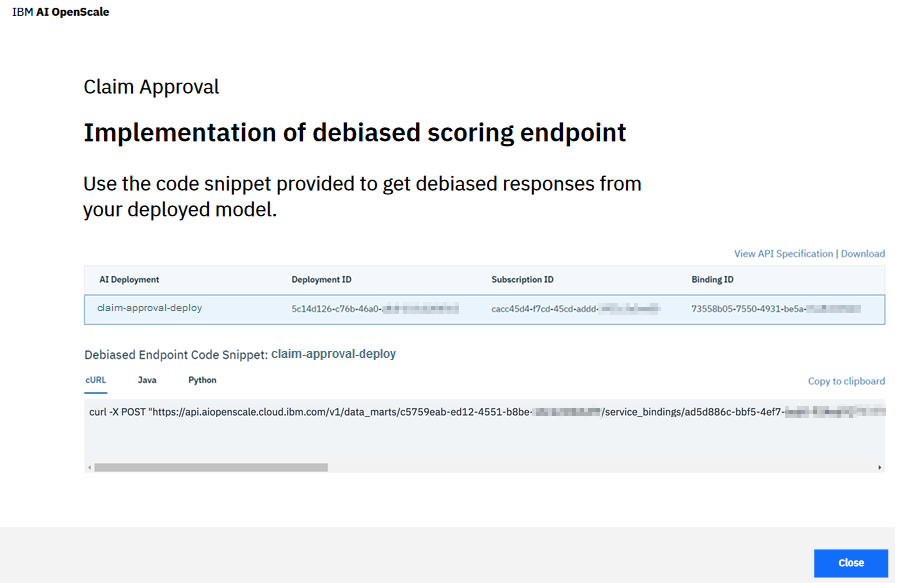

## Monitoring Explainability
{: #insight-explain}

For each deployment, you can see explainability data for specific transactions by selecting the Transactions tab (  ) in the navigator.

You will first be prompted to enter a Transaction ID. Whenever data is sent to the model for scoring, it sets a transaction ID in the HTTP header by setting the `X-Global-Transaction-Id` field. This transaction ID gets stored in the payload table. If you want to find an explanation of the model behavior for a particular scoring, then it can be done by specifying the transaction id associated with that scoring request. See the tutorial for information about [finding and using a transaction ID](https://console.bluemix.net/docs/services/ai-openscale/getting-started.html#view-explainability-for-a-model-transaction).

  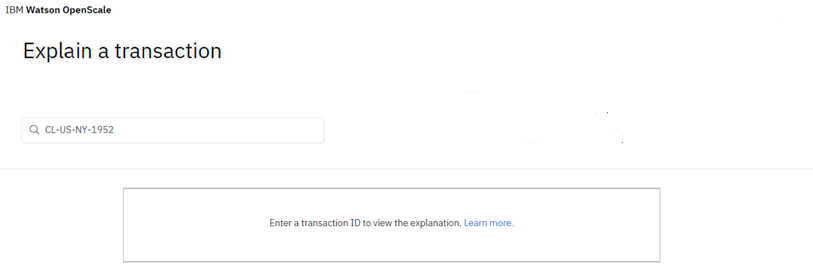

### Categorical models
In this example, using a binary classification model that approves or denies insurance claims, you can see the confidence in the model prediction (90%). You can also see the factors that contributed positively or negatively to the final outcome of `DENIED` in this case.

The feature *POLICY AGE* having a value of `< 1 year` had the maximum impact in the model deciding a DENIED outcome. The other features that contributed to this outcome were *CLAIM FREQUENCY* (`High`) and *AGE* (`18`), with only a minor impact from *CAR VALUE* (`$50,000`).

  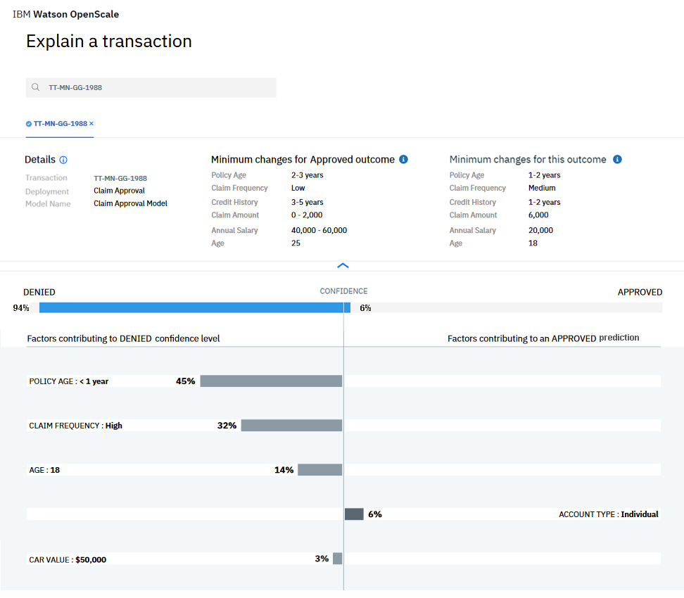

While the charts are useful in showing the most significant factors in determining the outcome of a transaction, classification models can also include advanced explanations, detailed in the `Minimum changes for an Approved outcome` and `Minimum factors supporting this outcome` sections.

Advanced explanations are not available for regression, image, and unstructured text models.
{: note}

The `Minimum changes for an Approved outcome` tells us that, if the values of the features were changed to the values listed in this section, then the prediction of the model will change.

Likewise, the `Minimum factors supporting this outcome` tells us that, even if the values of the features were changed to those listed in this section, the prediction of the model would not have changed.

Thus, these two values tell us the behaviour of the model in the vicinity of the data point for which the explanation is being generated.

  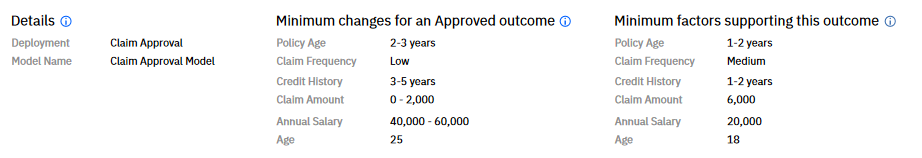

### Image models

For an image classification model example, you can see which parts of an image contributed positively to the predicted outcome and which contributed negatively. In the below example, the image on the right show the parts which impacted positively to the prediction and the image on the left shows the parts of images that had a negative impact on the outcome.

**Note**: Currently, explanations cannot be generated for images which are greater than 1 MB in size.

  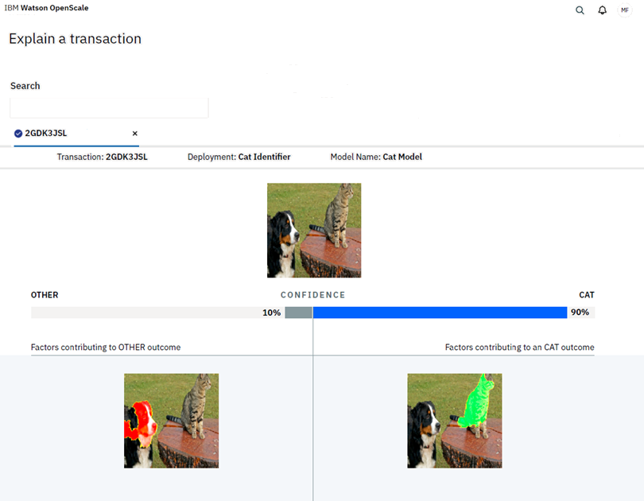

### Unstructured text models

Finally, an example of a classification model that evaluates unstructured text. The explanation shows the keywords that had a positive as well as a negative impact on the model prediction. We also show the position of the identified keywords in the original text which was fed as input to the model.

  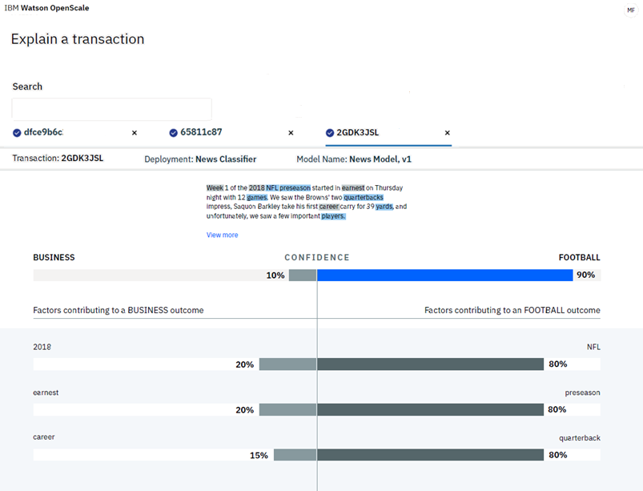
