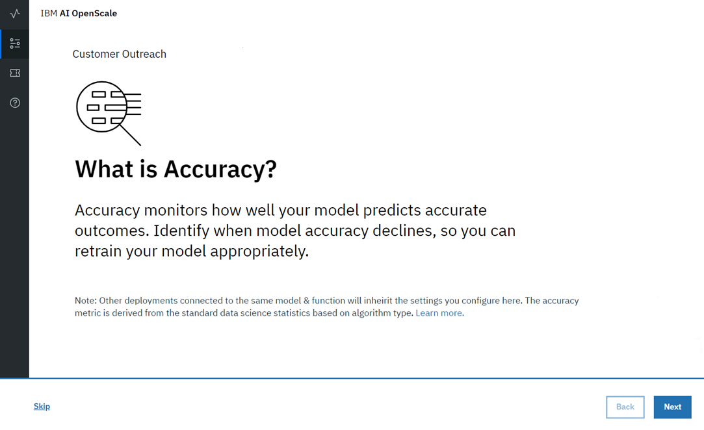
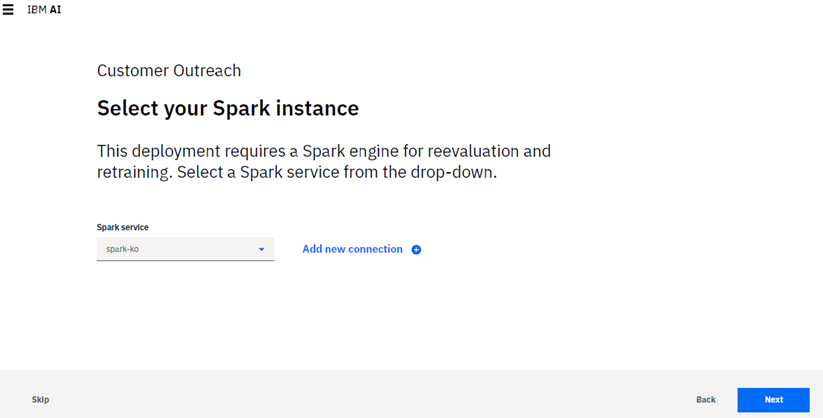
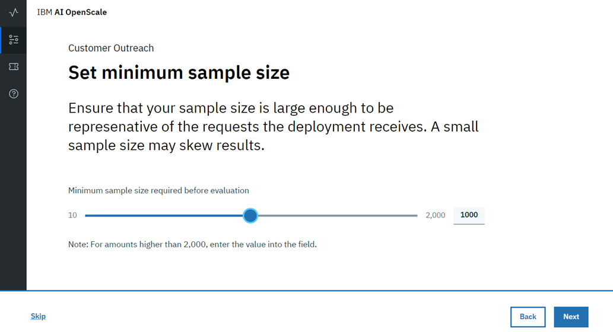
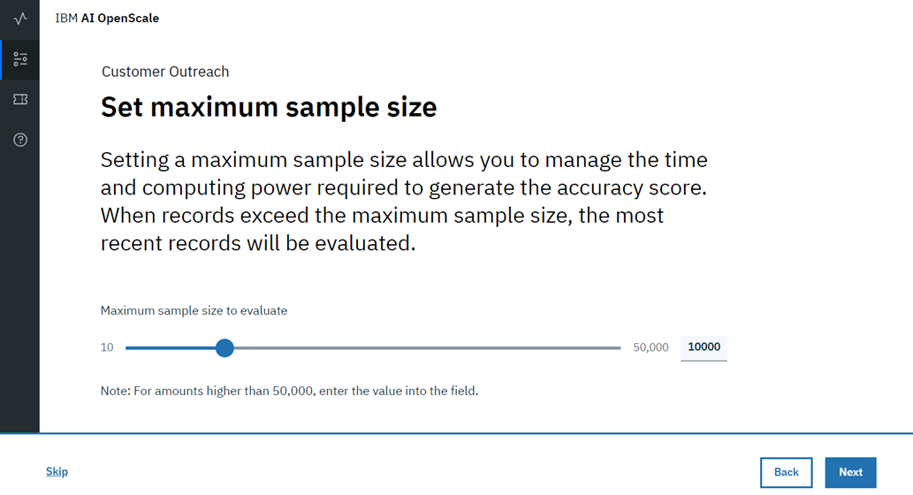
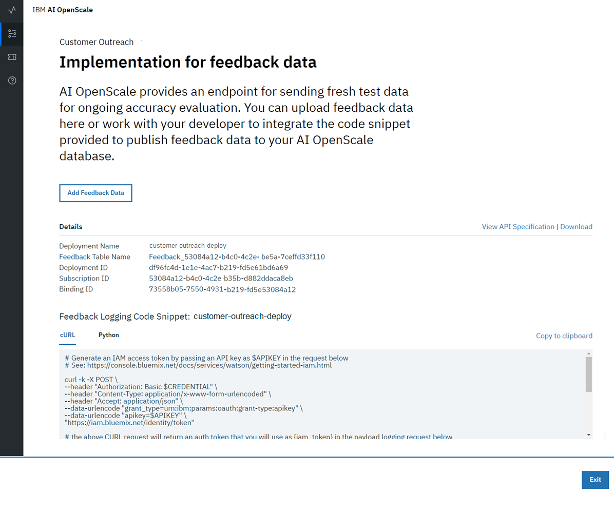

---

copyright:
  years: 2018
lastupdated: "2018-12-05"

---

{:shortdesc: .shortdesc}
{:new_window: target="_blank"}
{:tip: .tip}
{:important: .important}
{:note: .note}
{:pre: .pre}
{:codeblock: .codeblock}
{:screen: .screen}

# Accuracy
{: #monitor-accuracy}

Accuracy lets you know how well your model predicts outcomes.
{: shortdesc}

## Understanding Accuracy
{: #understand-accuracy}

Accuracy can mean different things depending on the type of the algorithm:

- *Multi-class classification*: Accuracy measures the number of times any class was predicted correctly, normalized by the number of data points. For more details, see [Multi-class classification](https://spark.apache.org/docs/2.1.0/mllib-evaluation-metrics.html#multiclass-classification) in the Apache Spark documentation.

- *Binary classification*: For a binary classification algorithm, accuracy is measured as the area under an ROC curve. See [Binary classification](https://spark.apache.org/docs/2.1.0/mllib-evaluation-metrics.html#binary-classification) in the Apache Spark documentation for more details.

- *Regression*: Regression algorithms are measured using the Coefficient of Determination, or R2. For more details, see [Regression model evaluation](https://spark.apache.org/docs/2.1.0/mllib-evaluation-metrics.html#regression-model-evaluation) in the Apache Spark documentation.

### How it works

You need to add manually-labelled data into your feedback table for the accuracy computation to trigger. The feedback table is in the posgres schema with the name <model_id>_feedback.

You can create a performance monitoring system for your predictive models by creating an evaluation instance, and then defining the metrics and triggers for the automatic retraining and deploying of the new model. Spark, Keras and TensorFlow models are supported at this stage, with the following requirements:

- A training definition must be stored in the repository
- `training_data_reference` - must be defined as a part of the stored model's metadata
- `training_definition_url` - must be defined as a part of the stored model's metadata

Use the available [REST API](https://watson-ml-api.mybluemix.net/) end-points directly to provide feedback data and kick off evaluation activities. For more information, see the [WML documentation](https://dataplatform.cloud.ibm.com/docs/content/analyze-data/ml-continuous-learning.html?audience=wdp&context=wdp).

## Configuring the Accuracy monitor
{: #config-accuracy}

1.  From the *What is Accuracy?* page, click **Next** to start the configuration process.

    

<!---

1.  If your model was created with Apache Spark, you must select a Spark instance; this will be the engine that processes model reevaluation and retraining. The system will detect any Spark instances in your IBM Cloud account.

    **NOTE** - if an existing Spark instance is not found, or if you want to provision a new Spark service, click the **Add new connection** link to access the Apache Spark landing page in {{site.data.keyword.Bluemix_notm}}.

    

    Click **Next** to continue.

--->

1.  On the *Set accuracy threshold* page, select a value that represents an acceptable accuracy level.

    Accuracy is a value synthesized from relevant data science metrics associated with each particular model type. The score is a normalized measure to allow you to easily compare accuracy across different model types. In typical situations, an accuracy score of 80 is sufficient.
    {: note}

    

    Click **Next** to continue.

1.  Now, set a minimum sample size, to prevent measuring Accuracy until a minimum number of records are available in the evaluation dataset. This ensures the sample size is not too small to skew results.

     

1.  Finally, set a maximum sample size, to better manage the time and effort it takes to evaluate the dataset. Only the most recent records will be evaluated if this size is exceeded.

     

1.  Click the **Next** button.

    A summary of your selections is presented for review. If you want to change anything, click the **Edit** link for that section.

1.  Click **Save** to complete your configuration.

You are now presented with the option to directly provide feedback data to your model, to evaluate for accuracy.

  

Select the *Add Feedback Data* button to upload a CSV-formatted data file; set the delimiter to match your data.

  

File sizes are currently limited to 8MB.
{: note}

Alternately, you can publish feedback data using the provided `cURL` or `Python` code snippets.

The fields and values in the code snippets need to be substituted with your real values, as the ones provided are only examples.
{: important}

You can also choose **Exit** to skip this optional step; you will still be able to upload a CSV file for evaluation at a later time.

### Next steps
{: #accuracy-next}

From the *Configure monitors* page, you can select another monitoring category.
