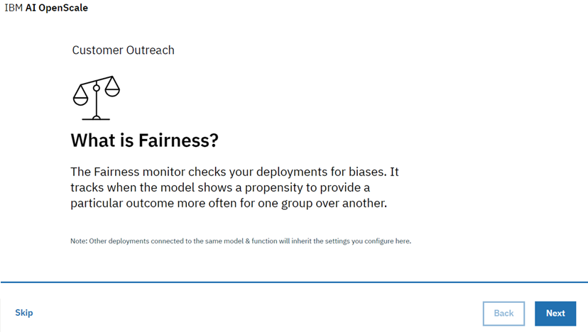
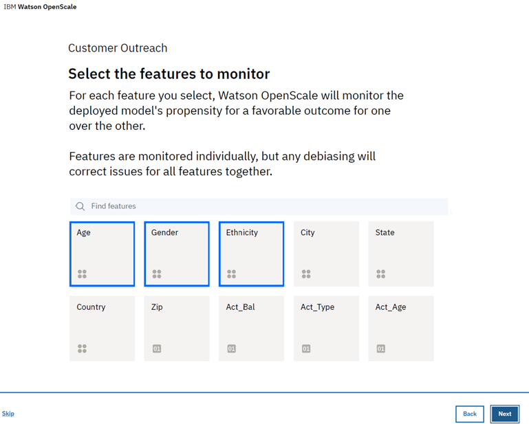
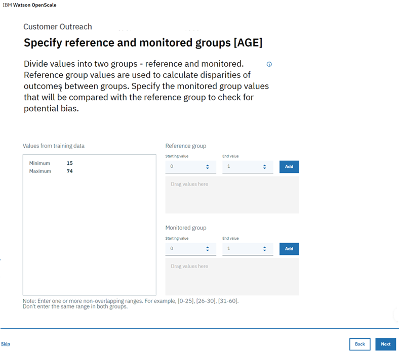
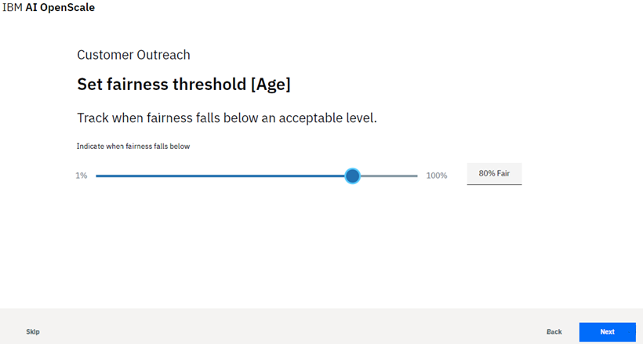
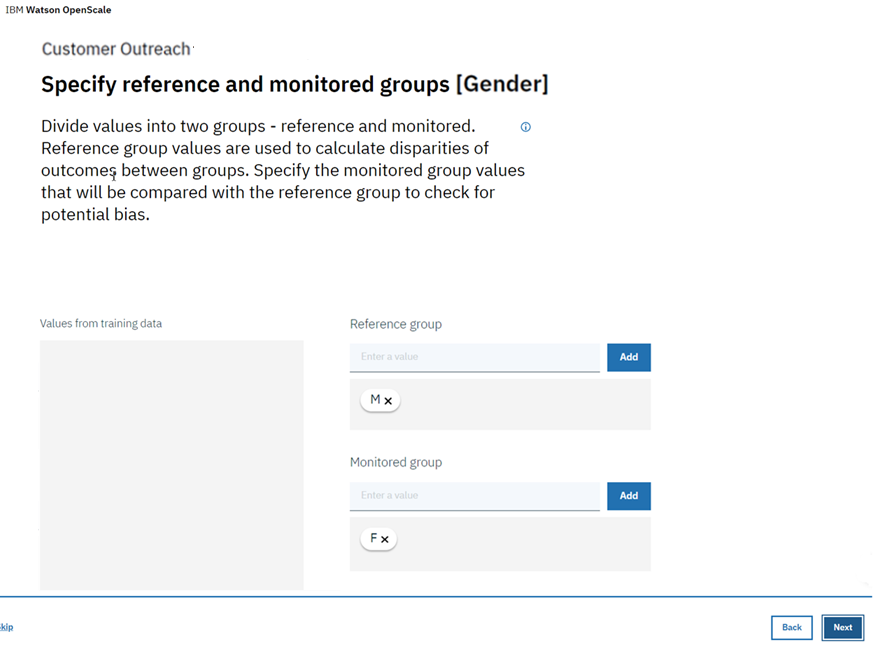
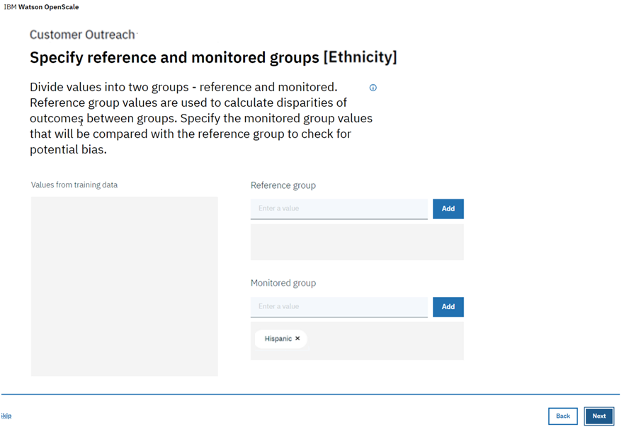
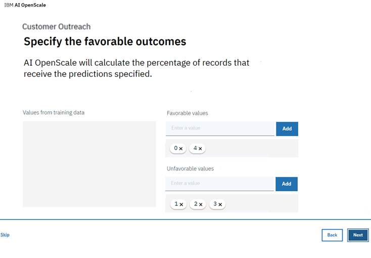
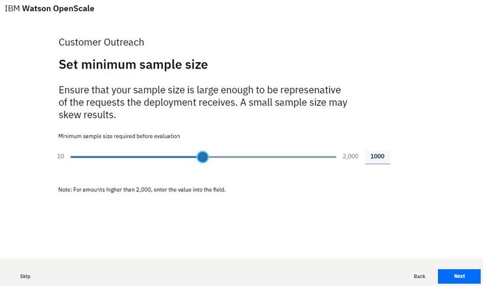

---

copyright:
  years: 2018
lastupdated: "2018-12-03"

---

{:shortdesc: .shortdesc}
{:new_window: target="_blank"}
{:tip: .tip}
{:important: .important}
{:note: .note}
{:pre: .pre}
{:codeblock: .codeblock}
{:screen: .screen}

# Fairness
{: #monitor-fair}

Fairness monitors your deployment for biases, to help ensure fair outcomes across different populations.
{: shortdesc}

## Understanding Fairness
{: #understand-fair}

{{site.data.keyword.aios_short}} checks your deployed model for bias at runtime. To detect bias for a deployed model, you must define feature requirements, such as Age or Gender, as detailed in [Configuring the Fairness monitor](monitor-fairness.html#config-fair) below.

It is mandatory to specify the output schema for a model or function in Watson Machine Learning (WML), for bias checking to be enabled in {{site.data.keyword.aios_short}}. The output schema can be specified using the `client.repository.ModelMetaNames.OUTPUT_DATA_SCHEMA` property in the metadata part of the `store_model` API. For more information, see the [WML client documentation](http://wml-api-pyclient-dev.mybluemix.net/#repository)

### How it works

Before configuring the Fairness monitor, there a few key concepts that are critical to understand:

- *Fairness attributes*: These are the model attributes for which the model is likely to exhibit bias. As an example, for the fairness attribute **`Gender`**, the model could be biased against specific gender values (`Female`, `Transgender`, etc.) Another example of a fairness attribute is **`Age`**, where the model could exhibit bias against people in an age group, like `18 to 25`.
  
- *Reference / Monitored value*: The values of fairness attributes are split into two distinct categories: Reference and Monitored. The Monitored values are those which are likely to be discriminated against. In the case of a fairness attribute like **`Gender`**, the Monitored values could be `Female` and `Transgender`. For a numeric fairness attribute, such as **`Age`**, the Monitored values could be `[18-25]`. All other values for a given fairness attribute are then considered as Reference values, for example `Gender=Male` or `Age=[26,100]`.
  
- *Favorable / Unfavorable outcome*: The output of the model is categorized as either Favorable or Unfavorable. As an example, if the model is predicting whether a person should get a loan or not, then the Favorable outcome could be `Loan Granted` or `Loan Partially Granted`, whereas the Unfavorable outcome might be `Loan Denied`. Thus, the Favorable outcome is one that is deemed as a positive outcome, while the Unfavorable outcome is deemed as being negative.

The {{site.data.keyword.aios_short}} algorithm computes bias on an hourly basis, using the last `N` records present in the payload logging table; the value of `N` is specified when configuring Fairness. The algorithm perturbs these last `N` records to generate additional data.

The perturbation is done by changing the value of the fairness attribute from Reference to Monitored, or vice-versa. The perturbed data is then sent to the model to evaluate its behavior. The algorithm looks at the last `N` records in the payload table, and the behavior of the model on the perturbed data, to decide if the model is acting in a biased manner.

A model is deemed to be biased if, across this combined dataset, the percentage of Favorable outcomes for the Monitored class is less than the percentage of Favorable outcomes for the Reference class, by some threshold value. This threshold value is to be specified when configuring Fairness.

Fairness values can be more than 100%. This means that the Monitored group received more favorable outcomes than the Reference group. In addition, if no new scoring requests are sent, then the Fairness value will remain constant.
{: note}

### Example

Consider a data point where, for `Gender=Male` (Reference value), the model predicts an Favorable outcome, but when the record is perturbed by changing `Gender` to `Female` (Monitored value), while keeping all other feature values the same, the model predicts an Unfavorable outcome. A model overall is said to exhibit bias if there are sufficient data points (across the last `N` records in the payload table, plus the perturbed data) where the model was acting in a biased manner.

### Supported models

 {{site.data.keyword.aios_short}} supports bias detection only for those models and Python functions which expect some kind of structured data in its feature vector. In the current release, bias detection is supported only for classification models (models which predict a categorical value); {{site.data.keyword.aios_short}} does not support bias detection for regression models (models which predict a continuous value).

## Configuring the Fairness monitor
{: #config-fair}

1.  From the *What is Fairness?* page, click **Next** to start the configuration process.

    

1.  On the *Select the features to monitor* page, find and select fairness attributes that you want to use and click **Next**.

    **Note**: Only features which are of categorical, numeric (integer), float, or double fairness data type are supported. Features with other data types are not supported.

    In this example, the `Age`, `Gender`, and `Ethnicity` features have been selected.

    

    Click **Next** to continue.

1.  Each feature has specific requirements to configure. In this example, you define the **`Age`** ranges for a Reference Group and a Monitored Group by manually entering values directly in each group.

    In this example, for the **`Age`** fairness attribute, if you feel that your model is likely to be biased against people with ages between 18 and 25, then the Monitored Group value will be `[18-25]` and the Reference Group value will be `[26-100]`. In case of the **`Gender`** fairness attribute, the Reference Group value might be `Male`, while the Monitored Group values could be `Female` and `Transgender`.

    

    Click **Next** to continue

1.  Set the threshold limit for Fairness, for **`Age`**.

    A Fairness threshold is used to specify an acceptable difference between the percentage of Favorable outcomes for the Monitored group as compared to the percentage of Favorable outcomes for the Reference group.

    Consider a model that predicts who should get a loan (`favorable outcome=loan granted`) and who shouldn’t (`unfavorable outcome=loan denied`). Further, the Monitored value for age is `[18,25]`, and the Reference value is `[26,100]`. When the bias detection algorithm runs, if it finds that the percentage of Favorable outcomes for people in the age group `[18,25]` in the last `N` records plus perturbed data is `50%`, while the percentage of Favorable outcomes for people in the age group `[26,100]` is `70%`, then Fairness is computed as 50*100/70 = 71.42.

    If the Fairness threshold is set to 80%, then the algorithm will flag the model as being biased, because the computed Fairness is lower than the threshold. However, if the threshold is set to 70% then it will not report the model as being biased.

    

    Click **Next** once you have selected a Fairness threshhold.

1.  Configure the `Gender` and `Ethnicity` features in the same manner:

     

     

     **Note**: The values that you enter in these screens should be those that are sent to the model scoring endpoint (and consequently will be added to the payload table). If the data is being manipulated before sending to the scoring endpoint, then enter the manipulated values. For example, if the original data had values of `Male` and `Female` for *Gender* and it was manipulated so that the data sent to the scoring endpoint was `M` and `F`, then enter `M` and `F` on this screen.

     Click **Next** when you are done with each feature.

1.  Now, specify values that represent a favorable outcome for the model. Values are derived from the `label` column in the training data, if the model output schema contains a mapping column. In WML, the `prediction` column always has a double value. The mapping column is used to specify the mapping of this `prediction` value to the class label.

    For example, if the `prediction` value is `1.0`, the mapping column could have a value of `Loan denied`; this implies that the prediction of the model is `Loan denied`. So, if the model output schema contains a mapping column, then specify Favorable and Unfavorable values using those present in the mapping column.

    If, however, the mapping column is not present in the model output schema, then the Favorable and Unfavorable values need to be specified using the value of the `prediction` column (`0.0`, `1.0`, etc.)

     

     Click **Next**.

1.  Finally, set a minimum sample size, to prevent measuring Fairness until a minimum number of records are available in the evaluation dataset. This ensures the sample size is not too small to skew results. Every time bias checking runs, it will use the minimum sample size to decide the number of records on which it will do the bias computation.

     

1.  Click the **Next** button.

    A summary of your selections is presented for review. If you want to change anything, click the **Edit** link for that section.

    You can also select the **Add another feature** link to return to the feature selection screen and add more features to the Fairness monitor, for example: `City`, `Zip Code` or `Account Balance`.

1.  Click **Save** to complete your configuration.

### Next steps
{: #fair-next}

From the *Configure monitors* page, you can select another monitoring category.
