---

copyright:
  years: 2018
lastupdated: "2018-12-10"

---

{:shortdesc: .shortdesc}
{:new_window: target="_blank"}
{:tip: .tip}
{:important: .important}
{:note: .note}
{:pre: .pre}
{:codeblock: .codeblock}
{:screen: .screen}

# Preparing monitors for a deployment
{: #monitor-config}

Set up and enable monitors for each deployment that you are tracking with {{site.data.keyword.aios_short}}.
{: shortdesc}

## Selecting a deployment

1.  First, you must select a deployment.

    If there are multiple deployments for a given model, then when you configure one deployment, all other deployments for the same model also get configured.
    {: note}

    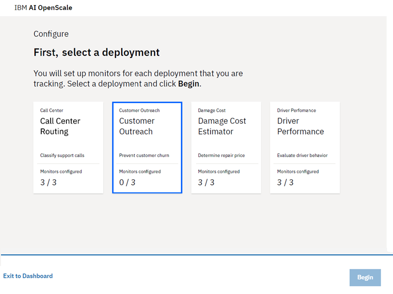

1.  Select the *Prepare for monitoring* tile, and click **Begin**.

    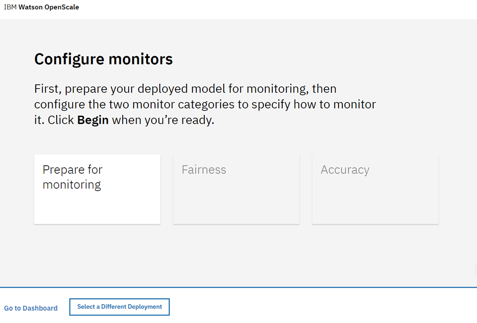

## Working with data

1.  Now you will provide information about your model and training data; click **Next**.

    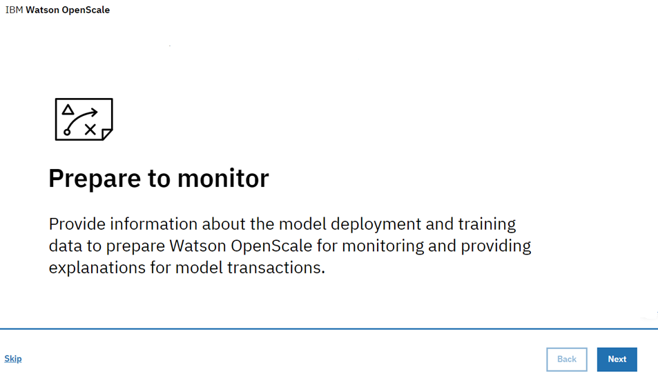

1.  From the drop-down menu, select the type of data your deployment analyzes, and click **Next**.

    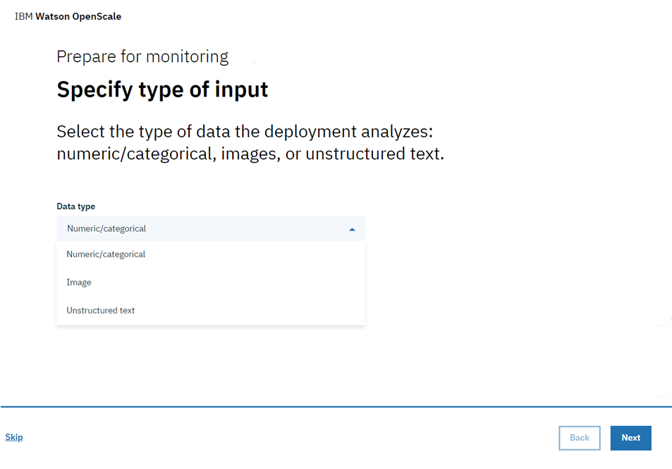

### Numeric/categorical data

For numeric or categorical data, you need to provide information about the training data for your model, in order to configure the monitors.

  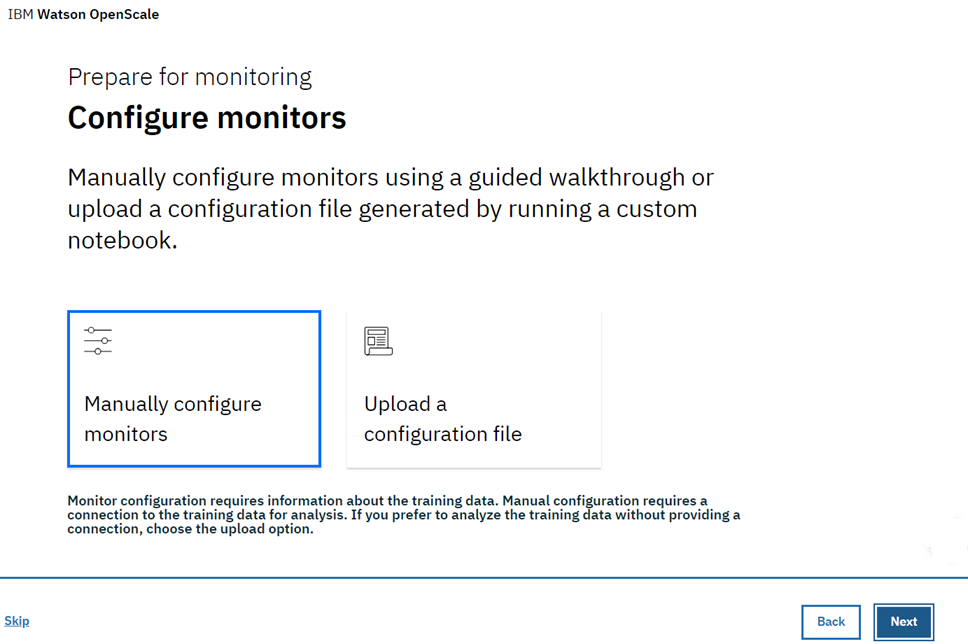

- **Manually configure monitors** - Requires you to provide connection information to your training data.

    - Select the [algorithm type](/docs/services/ai-openscale/monitor-accuracy.html#understand-accuracy), and click **Next**:

      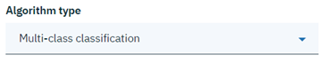

      Please ensure that the format of the training data is exactly the same as that expected by your model. For example, if the model expects `M` and `F` for the feature *Gender* then the training data should have `M` and `F`, not `Male` and `Female`. Currently {{site.data.keyword.aios_short}} supports Db2 database or Cloud Object Storage locations only.
        {: important}

    - Specify the Location (either `Db2` or `Cloud Object Storage`), then:

        - For a Db2 database, complete the following:

            - Host name or IP address
            - Port
            - Database (name)
            - Username
            - Password

            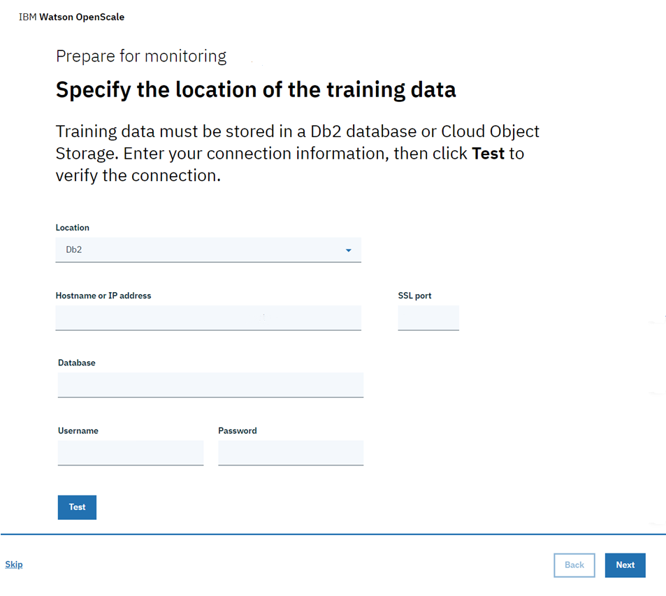

        - For Cloud Object Storage, complete the following:

            - Log-in URL
            - Resource instance (ID)
            - API key

            

    - Ensure a valid connection by clicking the **Test** button to connect to the training data. Click **Next**.

    - Specify the exact location in the Db2 database or Cloud Object Storage where the training data is located.

        - For a Db2 database, select both a schema and a training table that includes columns expected by your model:

          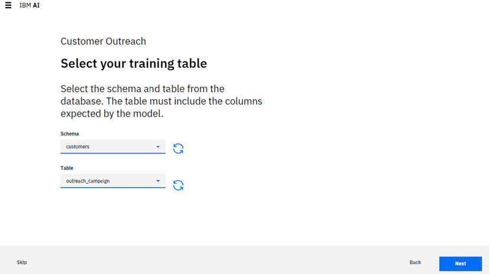

        - For Cloud Object Storage, select a Bucket and a Data Set:

          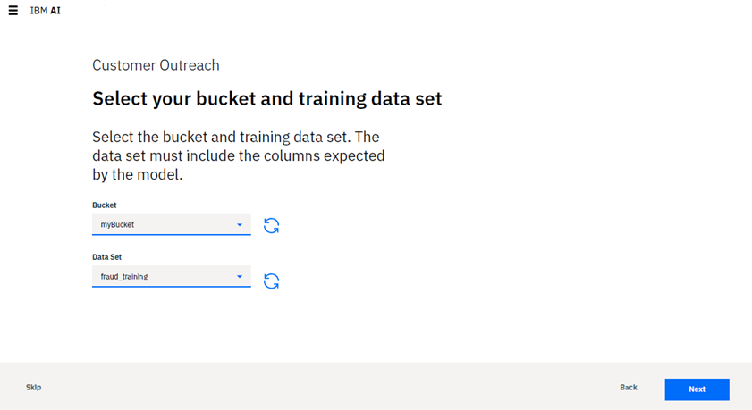

          Click **Next** to proceed to Step 5 below.

- **Upload a configuration file** - Choose this option if you prefer to keep your training data private. You can use a custom Python notebook to provide {{site.data.keyword.aios_short}} with information to analyze your training data without providing access to the training data itself.

  Running the Python notebook lets you capture distinct values in the schema columns, as well as the column names. In addition, you can use the notebook to pre-configure the Fairness monitor.

    - Download the [custom notebook](https://github.com/IBM-Watson/aios-data-distribution/blob/master/training_statistics_notebook.ipynb), and replace any credentials with your own credentials.

    - Review the notebook carefully, specifying data for your model where appropriate. Save the notebook.

    - Run the notebook to generate a JSON-formatted configuration file.

    - Upload the JSON configuration file.

        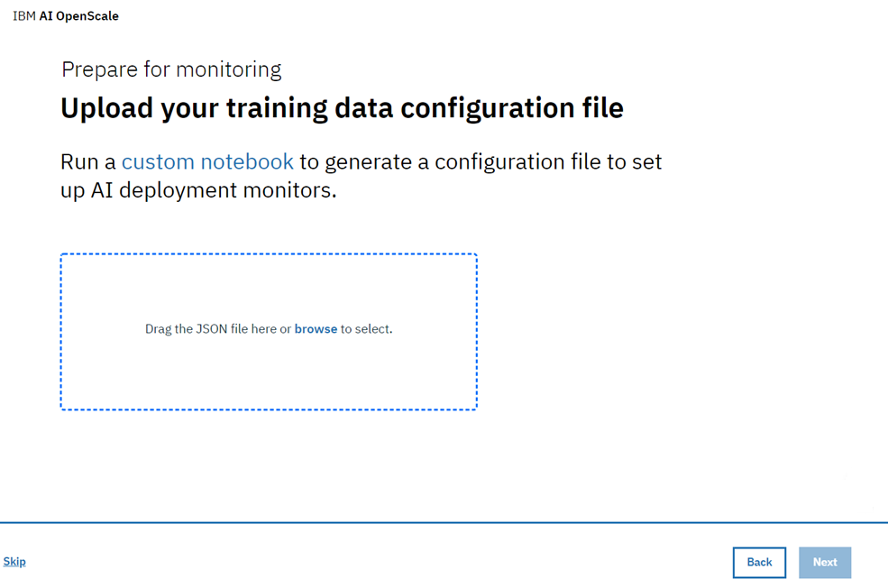

    - Click **Next**.

- {{site.data.keyword.aios_short}} will locate your training data from the metadata stored with the model in WML. Choose the label column in the training data that contains your prediction values and click **Next**.

  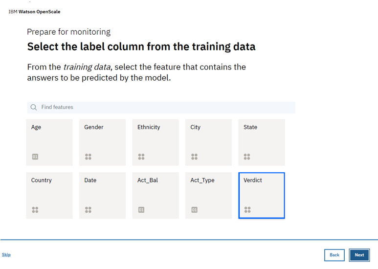

- Select the columns used to train the model - these are the features that your model deployment expects in a request. Click **Next**.

    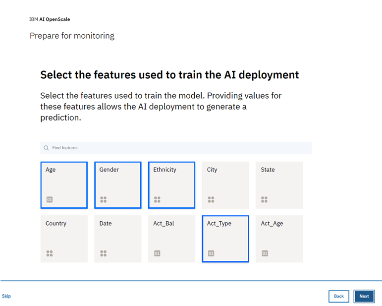

- Finally, select the columns that contained text, and have been converted to integers. For example, if the original training data contained `Male` and `Female` for *Gender*, and they have now been mapped to `0` and `1` respectively, the training data now contains `0` and `1` values for the *Gender* column. Identify such columns which now contain integers, but originally contained text values. Click **Next**.

    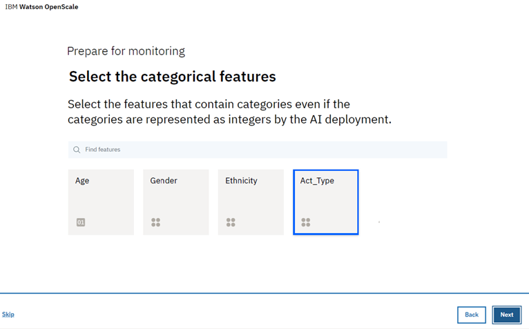

### Images and Unstructured text

- **Images**

  For models that accept images as input, the image needs to be represented as a (height) x (width) x (# channels) format, where each point represents either monochrome or RGB values for each pixel.

- **Unstructured text**

   For models that accept text as input, it is expected that the model accepts the entire text, and not a vectorized representation of the text.

## Review and save configuration

Review your selection summary and click **Save** to continue.

  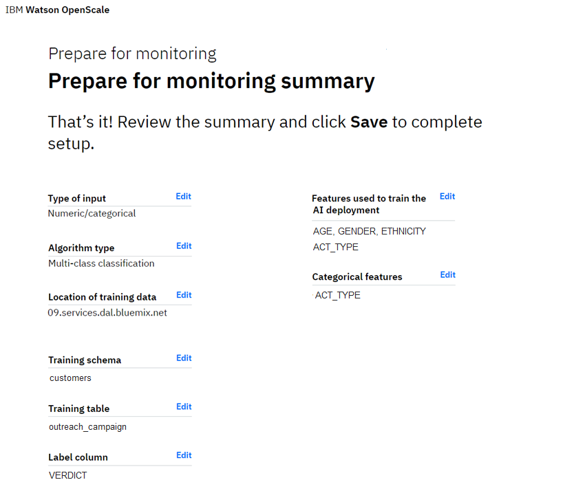

### Next steps
{: #monitor-next}

To begin configuring monitors, select a category and click **Begin**.
