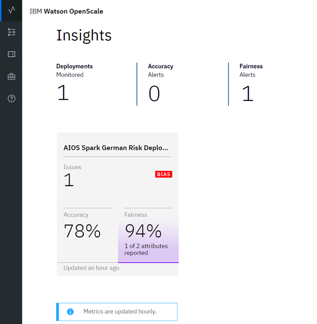
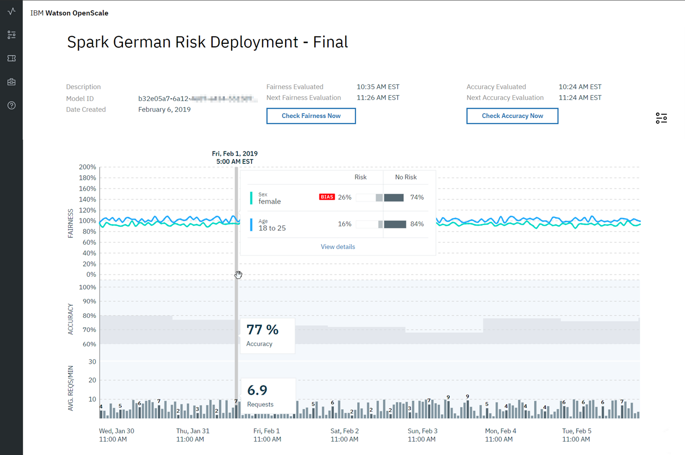
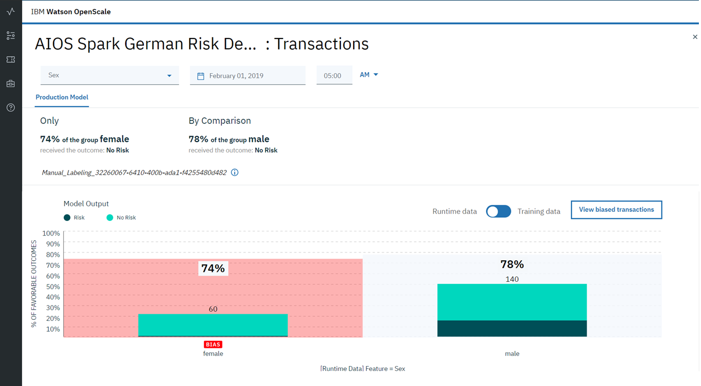
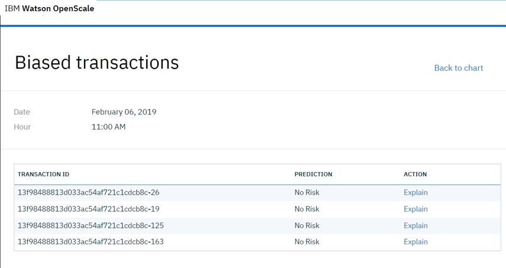
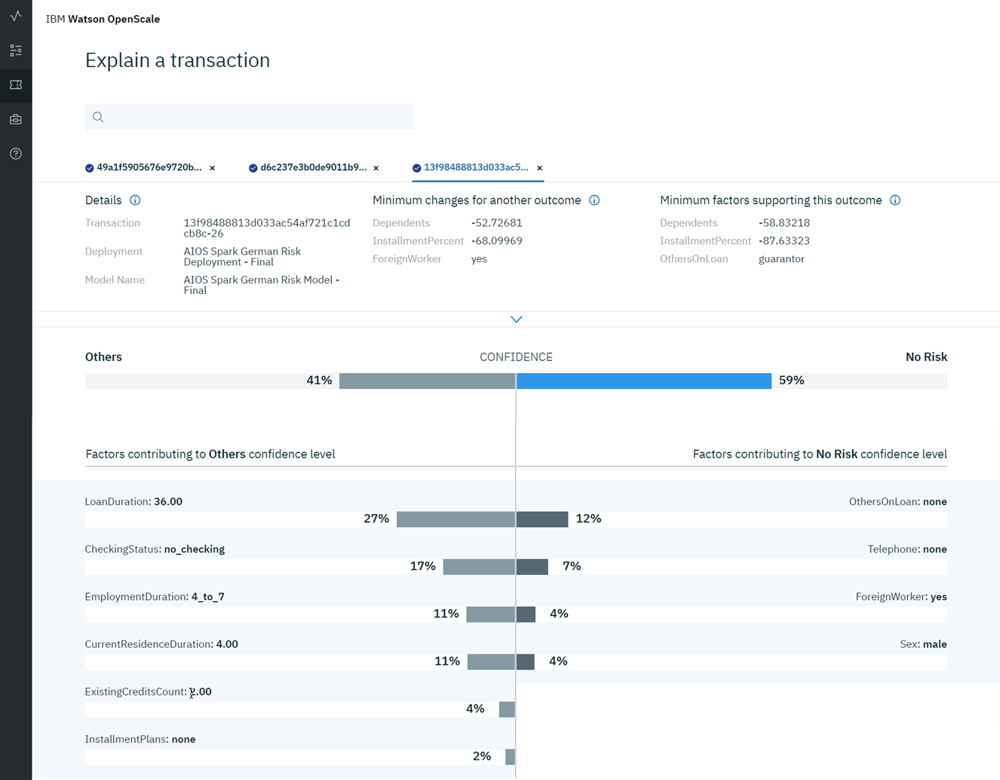

---

copyright:
  years: 2018, 2019
lastupdated: "2019-03-28"

---

{:shortdesc: .shortdesc}
{:new_window: target="_blank"}
{:tip: .tip}
{:important: .important}
{:note: .note}
{:pre: .pre}
{:codeblock: .codeblock}
{:screen: .screen}
{:javascript: .ph data-hd-programlang='javascript'}
{:java: .ph data-hd-programlang='java'}
{:python: .ph data-hd-programlang='python'}
{:swift: .ph data-hd-programlang='swift'}

# Tutorial - (Advanced)
{: #crt-ov}

In this tutorial, you learn to perform the following tasks:

- Run a Python notebook to create, train and deploy a machine learning model. 
- Create a data mart, configure performance, accuracy, and fairness monitors, and create data to monitor.
- View results in the {{site.data.keyword.aios_short}} Insights tab.

## Scenario
{: #crt-scenario}

Traditional lenders are under pressure to expand their digital portfolio of financial services to a larger and more diverse audience, which requires a new approach to credit risk modeling. Their data science teams currently rely on standard modeling techniques - like decision trees and logistic regression - which work well for moderate datasets, and make recommendations that can be easily explained. This satisfies regulatory requirements that credit lending decisions must be transparent and explainable.

To provide credit access to a wider and riskier population, applicant credit histories must expand beyond traditional credit, like mortgages and car loans, to alternate credit sources like utility and mobile phone plan payment histories, plus education and job titles. These new data sources offer promise, but also introduce risk by increasing the likelihood of unexpected correlations which introduce bias based on an applicant’s age, gender, or other personal traits.

The data science techniques most suited to these diverse datasets, such as gradient boosted trees and neural networks, can generate highly accurate risk models, but at a cost. Such "black box" models generate opaque predictions that must somehow become transparent, to ensure regulatory approval such as Article 22 of the General Data Protection Regulation (GDPR), or the federal Fair Credit Reporting Act (FCRA) managed by the Consumer Financial Protection Bureau.

The credit risk model provided in this tutorial uses a training dataset that contains 20 attributes about each loan applicant. Two of those attributes - age and sex - can be tested for bias. For this tutorial, the focus is on bias against sex and age.

{{site.data.keyword.aios_full}} for {{site.data.keyword.icpfull}} for Data monitors the deployed model's propensity for a favorable outcome ("No Risk") for one group (the Reference Group) over another (the Monitored Group). In this tutorial, the Monitored Group for sex is `female`, while the Monitored Group for age is `18 to 25`.

## Prerequisites
{: #crt-prereqs}

This tutorial uses a Jupyter notebook that should be run by using the “Python 3.5 with Spark” runtime environment. It requires service credentials for the following {{site.data.keyword.icpfull}} for Data services:

- {{site.data.keyword.aios_short}}

- {{site.data.keyword.pm_full}}

  You must associate a {{site.data.keyword.pm_short}} instance if you do not already have one associated with your account. If you have a [machine learning service that was provisioned as part of your {{site.data.keyword.icpfull}} for Data installation](ai-openscale-icp?topic=ai-openscale-icp-inst-install-icp#inst-wml), you must ensure that it is part of the same organization and space. 
  
- Db2 Warehouse
  
  You must associate a Db2 Warehouse service with your account if you do not already have one. If you have a [Db2 Warehouse service that was provisioned as part of your {{site.data.keyword.icpfull}} for Data installation](ai-openscale-icp?topic=ai-openscale-icp-inst-install-icp#inst-db2), you must ensure that it is part of the same organization and space.

When you choose a plan for each of the preceding {{site.data.keyword.icpfull_notm}} for Data services, there are several options, including a Lite plan. Although the Lite plan is free, it is restricted and provides only enough processing to run through the tutorial a couple of times before the montly limit is reached.
{: note}

## Introduction
{: #crt-intro}

Use the Jupyter notebook to train, create and deploy a German credit risk model, configure {{site.data.keyword.aios_short}} to monitor that deployment, and provide seven days' worth of historical records and measurements for viewing in the {{site.data.keyword.aios_short}} Insights dashboard.

## Create and deploy a machine learning model
{: #crt-make-model}

### Add the `IBM Watson OpenScale Lab instructions` notebook to your favorite editor
{: #crt-add-notebook}

1. Download the [IBM Watson OpenScale Lab instructions ](https://github.com/emartensibm/german-credit/blob/master/german_credit_lab.ipynb).{: new_window}
2. Open the notebook in {{site.data.keyword.DSX}} or any Jupyter or Zeppelin notebook editor. For more information about working with notebooks in {{site.data.keyword.DSX_full}}, see [Notebooks](https://docs-icpdata.mybluemix.net/docs/content/SSQNUZ_current/com.ibm.icpdata.doc/dsx/notebooks-parent.html).

### Edit and run the `IBM Watson OpenScale Lab instructions` notebook
{: #crt-edit-notebook}

The `IBM Watson OpenScale Lab instructions` notebook contains detailed instructions for each step in the Python code you will run. As you work through the notebook, take some time to understand what each command is doing.

1. In the **Provision services and configure credentials** section, make the following changes:
    1. Follow the instructions to create, copy, and paste an API key.
    2. Replace the {{site.data.keyword.pm_full}} and Db2 Warehouse service credentials with the ones you created previously.
    3. Replace the database credentials with the ones you created for Db2 Warehouse.

2. After you provision your services and enter your credentials, your notebook is ready to run. Run each step of the notebook in sequence. Notice what is happening at each step, as described. Complete all the steps, including the steps in the **Additional data to help debugging** section.

The net result is that you will have created, trained, and deployed the **Spark German Risk Deployment** model to your {{site.data.keyword.aios_short}} service instance. {{site.data.keyword.aios_short}} will be configured to check the model for bias against sex (in this case, Female) or age (In this case, 18-25 years old).

## Viewing results
{: #crt-view-results}

### View insights for your deployment
{: #crt-view-insights}

From the [{{site.data.keyword.aios_short}} dashboard ](https://aiopenscale.cloud.ibm.com/aiopenscale/){: new_window}, click the **Insights** tab:

  

The Insights page provides an overview of metrics for your deployed models. You can view alerts for Fairness or Accuracy metrics that have fallen below the threshold set when running the notebook. The data and settings used in this tutorial create Accuracy and Fairness metrics similar to the ones shown here.

  

### View monitoring data for your deployment
{: #crt-view-mon-data}

Select a deployment by clicking the tile on the **Insights** page. The monitoring data for that deployment will appear. Slide the marker across the chart to select data for a specific one-hour window. Then select the **View details** link.

  

As you review the charts for the data you monitored, you can see that for the "Sex" feature, the group `female` received the favorable outcome "No Risk" slightly less (74%) than the group `male` (78%).

  

### View explainability for a model transaction
{: #crt-view-explain}

For each deployment, you can see explainability data for specific transactions.

If you already know which transaction you want to view, there's a quick way to look it up with the transaction ID. After you click the deployment tile, from the navigator, click the **Explain a transaction**  icon, type the transaction ID, and press **Enter**.
{: tip}

For the latest biased data, from the charts, click the **View transactions** button.

  

  A list of transactions where the deployment has acted in a biased manner appears. Select one of the transactions and click the **Explain** link.

  

An explanation of how the model arrived at its conclusion appears. This includes how confident the model was, the factors that contributed to the confidence level, and the attributes fed to the model.

  

## Next steps
{: #crt-next-steps}

- Learn more about [viewing and interpreting the data](/docs/services/ai-openscale-icp?topic=ai-openscale-icp-itc-timechart) and [monitoring explainability](/docs/services/ai-openscale-icp?topic=ai-openscale-icp-ie-ov).
