---

title: Trust and transparency for your machine learning models with AI OpenScale
description: Monitor your machine learning deployments for bias, accuracy, and explainability
duration: 120
intro: In this extended tutorial, you will provision IBM Cloud machine learning and data services, create and deploy machine learning models in Watson studio, and configure the new IBM AI OpenScale product to monitor your models for trust and transparency.
takeaways:
- See how AI OpenScale provides trust and transparency for AI models
- Understand how IBM Cloud services and Watson Studio technologies can provide a seamless, AI-driven customer experience

copyright:
  years: 2018
lastupdated: "2018-12-13"

---

{:shortdesc: .shortdesc}
{:new_window: target="_blank"}
{:tip: .tip}
{:important: .important}
{:note: .note}
{:pre: .pre}
{:codeblock: .codeblock}
{:screen: .screen}
{:javascript: .ph data-hd-programlang='javascript'}
{:java: .ph data-hd-programlang='java'}
{:python: .ph data-hd-programlang='python'}
{:swift: .ph data-hd-programlang='swift'}

# Tutorial (Advanced)

## Scenario

A car rental company has collected feedback data about customer satisfaction. The presented model uses this data to predict a course of action to follow up with a customer, for example to provide a voucher for their next rental.

The model uses customer data fields ID (an ID number), GENDER, STATUS (single or married), CHILDREN (number), AGE, CUSTOMER STATUS (active or inactive), CAR OWNER (yes or no), CUSTOMER SERVICE (customer comment), SATISFACTION (satisfied or unsatisfied), and BUSINESS AREA (product or service related) to predict one of four values (NA, voucher, free upgrade, on-demand pickup) for the ACTION data field.

## Prerequisites

To complete this tutorial, you will need:

- A [Watson Studio](https://dataplatform.ibm.com/) account.
- An [{{site.data.keyword.Bluemix_notm}}](https://console.bluemix.net) account.

During the tutorial, you will provision the following Lite (free) {{site.data.keyword.Bluemix_notm}} Services:

- Machine Learning
- Apache Spark
- Object Storage

You will also provision the following **paid** {{site.data.keyword.Bluemix_notm}} Service:

- PostgreSQL

  A $200 {{site.data.keyword.Bluemix_notm}} credit can be obtained by converting to a paid account with a credit card. If you already have a paid account, you will receive a one-time $16 refund of the cost for your first GB of storage, for one month.
  {: tip}

The PostgreSQL database and Watson Machine Learning instance must be deployed in the same {{site.data.keyword.Bluemix_notm}} account.
{: important}

If you have already provisioned the necessary services for example if you have completed the other tutorial, proceed to [Set up a Watson Studio project](tutorial-adv.html#set-up-a-watson-studio-project) below.

## Introduction

In this tutorial, you will:

- Provision {{site.data.keyword.Bluemix_notm}} machine learning and storage services
- Set up a Watson Studio project, and run a Python notebook to create, train and deploy a machine learning model
- Run a Python notebook to create a data mart, configure performance, accuracy, and fairness monitors, and create data to monitor
- View results in the {{site.data.keyword.aios_short}} Insights tab

## Provision {{site.data.keyword.Bluemix_notm}} Services

Login to your [{{site.data.keyword.Bluemix_notm}} account](https://console.bluemix.net) with your IBM ID. When provisioning services, particularly in the case of Apache Spark, Object Storage, and Db2 Warehouse, verify that your selected organization and space are the same for all services.

### Create a Watson Studio account

- [Create a Watson Studio instance](https://console.bluemix.net/catalog/services/watson-studio) if you do not already have one associated with your account:

  
  
- Give your service a name, choose the Lite (free) plan, and click the **Create** button.

### Provision a Machine Learning service

- [Provision a Watson Machine Learning instance](https://console.bluemix.net/catalog/services/machine-learning) if you do not already have one associated with your account:

  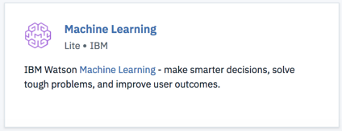
  
- Give your service a name, choose the Lite (free) plan, and click the **Create** button.

- Make note of the Machine Learning service credentials. In your machine learning instance, click on the **Service credentials** link on the left-hand side of the page. Name the credential and click **Add**. Then, from the list of credentials, click **View credential** and copy the credentials for later use.

### Provision a Spark service

- [Provision a Spark service](https://console.bluemix.net/catalog/services/apache-spark) if you do not already have one associated with your account:

  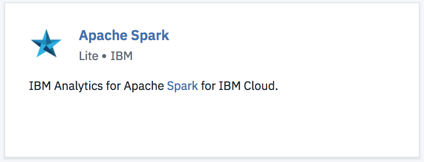
  
- Assign your service a name, choose the Lite (free) plan, and click the **Create** button.

- Make note of the service credentials for your Spark instance. Open your Spark instance and click on **Service credentials** in the left-hand menu. Click the **New credential** button, name your credentials, and click **Add**. Then, click the **View credentials** link next to the set you just created, and copy these credentials for later use.

### Provision an Object Storage service

- [Provision an Object Storage service](https://console.bluemix.net/catalog/services/cloud-object-storage) if you do not already one associated with your account:

  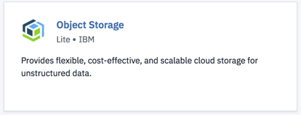
  
- Give your service a name, choose the Lite (free) plan, and click the **Create** button.

### Provision a paid PostgreSQL service

- [Provision a paid PostgreSQL service](https://console.bluemix.net/catalog/services/compose-for-postgresql) if you do not already have one associated with your account.

  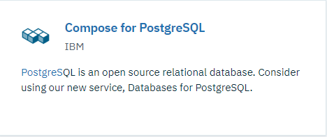

- Give your service a name, choose the Standard plan, and click the **Create** button.

  A $200 {{site.data.keyword.Bluemix_notm}} credit can be obtained by converting to a paid account with a credit card. If you already have a paid account, you will receive a one-time $16 refund of the cost for your first GB of storage, for one month.
  {: tip}

- Make note of the service credentials for your PostgreSQL instance. Open your existing (or newly-created) PostgreSQL instance and click on **Service credentials** in the left-hand menu. Click the **New credential** button, name your credentials, and click **Add**. Then, click the **View credentials** link next to the set you just created, and copy these credentials for later use.

<!---

### Provision a Db2 Warehouse service

- [Provision a Db2 Warehouse service](https://console.bluemix.net/catalog/services/db2-warehouse) if you do not already have one associated with your account:

  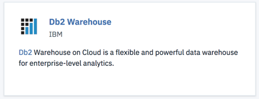
  
- Give your service a name, choose the Entry plan, and click the **Create** button.

- Make note of the service credentials for your Db2 Warehouse instance. Open your existing (or newly-created) Db2 Warehouse instance and click on **Service credentials** in the left-hand menu. Click the **New credential** button, name your credentials, and click **Add**. Then, click the **View credentials** link next to the set you just created, and copy these credentials for later use.

### Upload training and feedback data to Db2 Warehouse

- Download the [car_rental_training_data.csv](https://github.com/watson-developer-cloud/doc-tutorial-downloads/blob/master/ai-openscale/car_rental_training_data.csv) file.

- Open your existing (or newly-created) Db2 Warehouse from the [IBM Cloud console](https://console.bluemix.net), click **Manage** from the left side panel, and then click the green **Open** button.

- If necessary, use your Db2 credentials `username` and `password` to log in to Db2 Warehouse.

- Once Db2 Warehouse has opened, click the **Menu** button and select **Load** from the dropdown:

  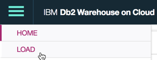
  
- Browse to the training data file, or drag and drop it into the appropriate area on the form. Click **Next**. Select a Schema from the list of load targets; this is usually in a format like `DASH12345`. Then click **New Table** on the right:

  
  
- Name your table CAR\_RENTAL\_TRAINING, and click the **Create** button:

  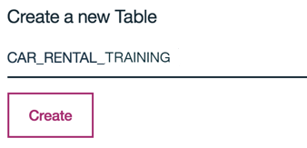
  
- Click **Next** to preview the data. On the preview screen, set the **Separator** field to a semicolon (;) and make sure the **Header in first row** option is checked:

  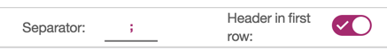

  **NOTE**: By default, the **Detect data types** option is selected.
  
  

  When selected, for columns set with the `VARCHAR` data type, the maximum number of characters allowed for that column is automatically determined by the largest data point uploaded for that column. If you expect that future data for a table column may exceed the automatically-determined maximum, simply unselect the **Detect data types** option, and edit the maximum column value manually.

  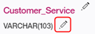

- The training data should now be displaying correctly in columns. Click **Next** to continue, and then click **Begin Load** to load the data.

--->

## Set up a Watson Studio project

- Login to your [Watson Studio account](https://dataplatform.ibm.com/). Click the account avatar icon in the upper right and verify that the account you are using is the same account you used to create your {{site.data.keyword.Bluemix_notm}} services:

  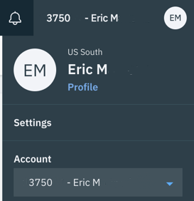

- In Watson Studio, begin by creating a new project. Select "Create a project":

  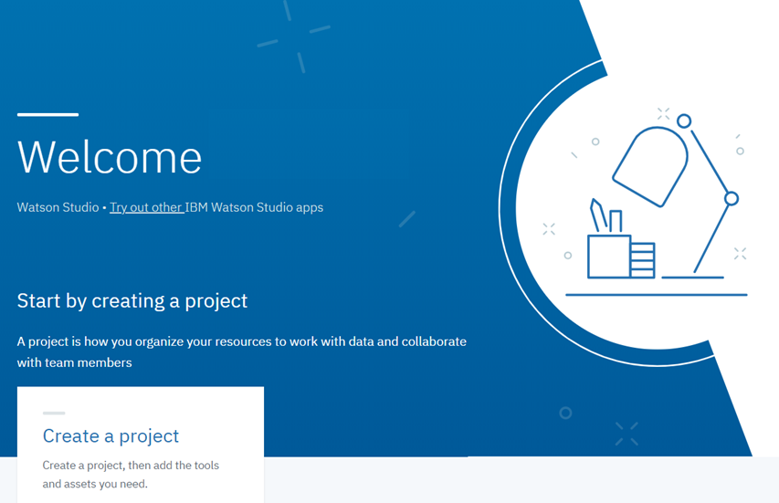

- Select the **Standard** tile, to create the project:

  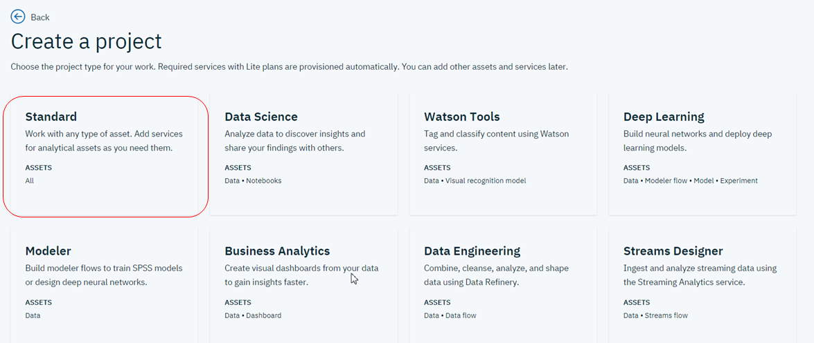

- Give your project a name and description, make sure the Object Storage service you created in the previous step is selected in the **Storage** dropdown, and click **Create**.

### Associate your {{site.data.keyword.Bluemix_notm}} Services with your Watson project

- Open your Watson Studio project and select the **Settings** tab. In the **Associated Services** section, click the **Add service** dropdown and select **Watson**:

  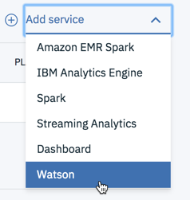
  
- Click the **Add** link on the **Machine Learning** tile and select the **Existing** tab. Choose the service you created in the previous section from the **Existing Service Instance** dropdown and click **Select**.

- From the project settings tab, select **Add service** again and choose **Spark** from the dropdown. From the **Existing** tab, choose the Spark service you created and click **Select**.

## Create and deploy a machine learning model

### Add the `CARS4U Action Recommendation - model` notebook to your Watson Studio project

- Download the following file:

    - [CARS4U Action Recommendation - model](https://github.com/pmservice/ai-openscale-tutorials/blob/master/notebooks/CARS4U%20action%20recommendation%20-%20model.ipynb)

- From the **Assets** tab in your Watson Studio project, click the **Add to project** button and select **Notebook** from the dropdown:

  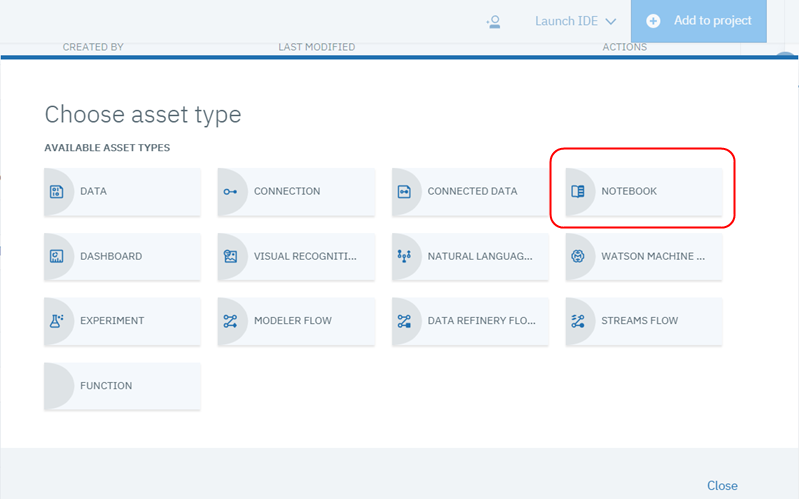
  
- Select **From file**:

  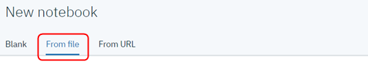

- Then click the **Choose file** button, and select the "CARS4U Action Recommendation - model" that you downloaded:

  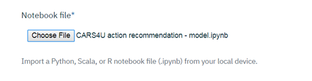

- In the **Select runtime** section, choose the Spark instance you created earlier from the dropdown list:

  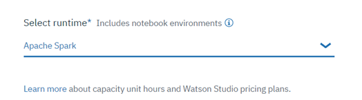
  
- Click **Create Notebook**.

### Edit and run the `CARS4U Action Recommendation - model` Notebook

The `CARS4U Action Recommendation - model` notebook contains detailed instructions for each step in the python code you will run. As you work through the notebook, spend some time to understand what each command is doing.
{: tip}

- From the **Assets** tab in your Watson Studio project, click the **Edit** icon next to the `CARS4U Action Recommendation - model` notebook to edit it.

- In section 2.2, "Upload data to PostgreSQL database", replace the Postgres service credentials with the ones you created in the previous section.

- In section 4, "Store the model in the repository", under **TIP**, replace the Watson Machine Learning credentials with the ones you created in the previous section.

- Once you have entered your credentials, your notebook is ready to run. Click the **Kernel** menu item, and select **Restart and Run All** from the menu:

  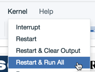
  
  This will create, train and deploy the **CARS4U - Action Recommendation Model** in your project. You can verify that the model has deployed by selecting the **Deployments** tab of your Watson Studio project, and clicking the **CARS4U - Area and Action Model Deployment** link.

## Configure {{site.data.keyword.aios_short}}

### Provision {{site.data.keyword.aios_short}}

- If you have not already provisioned an instance of {{site.data.keyword.aios_short}}, click the **Catalog** link from your {{site.data.keyword.Bluemix_notm}} account, and filter on "OpenScale". Select the tile for {{site.data.keyword.aios_short}}:

  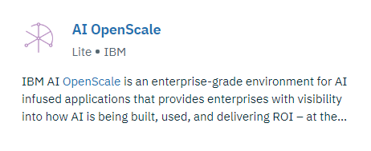
  
- Give your service a name, select the Lite plan, and click **Create**.

### Connect {{site.data.keyword.aios_short}} to your machine learning model

Since the machine learning model has been deployed, you can configure {{site.data.keyword.aios_short}} to ensure trust and transparency with your models. Select the **Manage** tab of your {{site.data.keyword.aios_short}} instance, and click the **Launch application** button. The {{site.data.keyword.aios_full}} Getting Started page opens; click **Begin**.

- Select the "Watson Machine Learning" tile and click **Next**.

  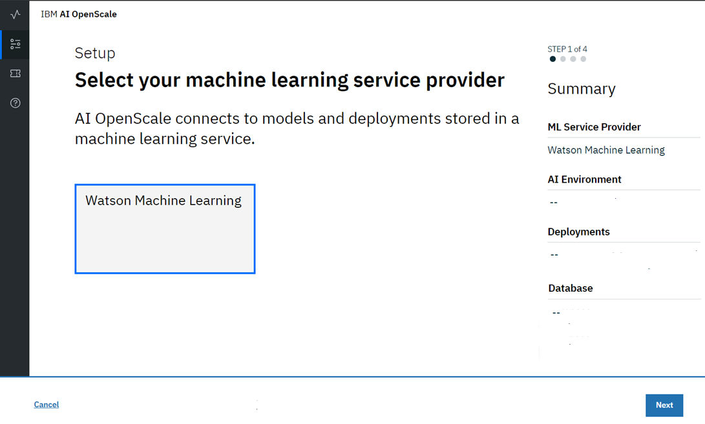

- Select your Watson Machine Learning instance from the drop-down, and click **Next**.

  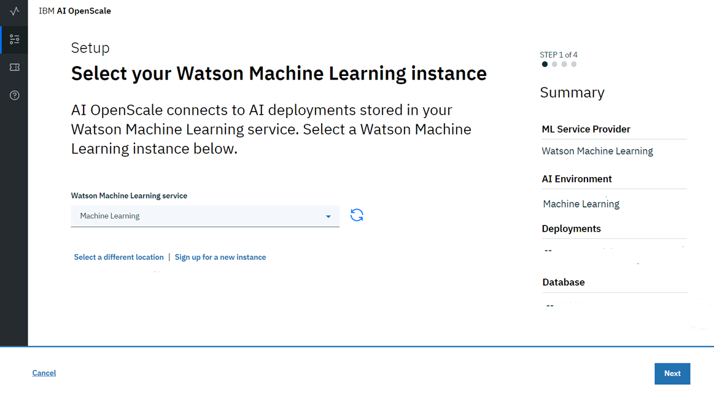

- You are now able to select which deployed models will be monitored by {{site.data.keyword.aios_short}}. Check the model you created and deployed; click **Next** to accept this:

  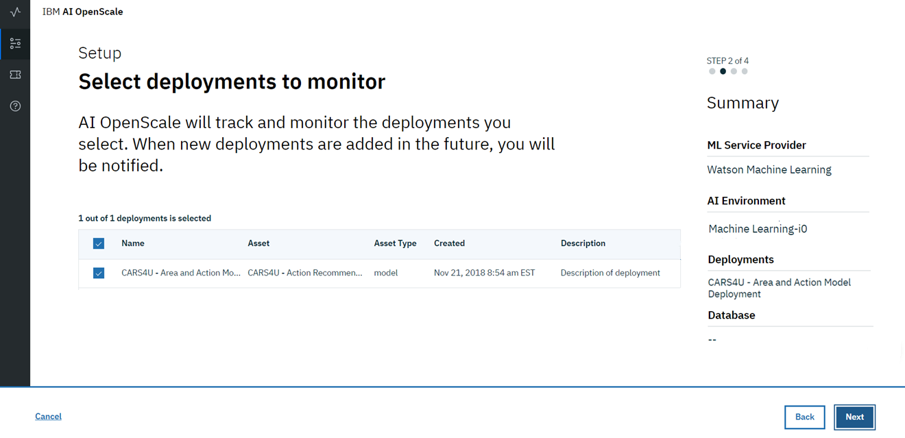

- Next, you need to choose a PostgreSQL database. You have two options: the free Lite plan database or an existing or new database. For this tutorial, select the **Use existing or purchase a new database** tile.

    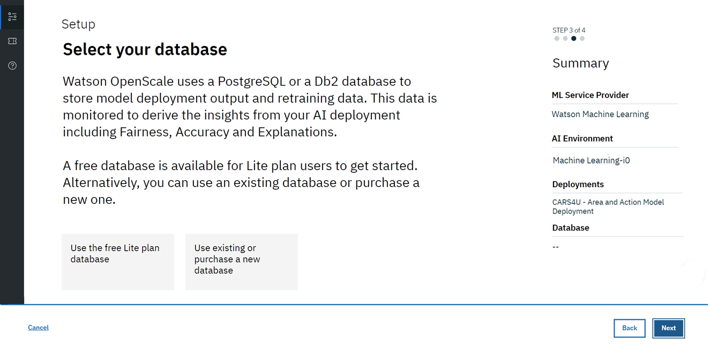

  **NOTE**: See more complete details about each of these options in the [Specify your database](/docs/services/ai-openscale/connect-db.html) topic.

- Once you have selected the "Use existing or purchase new database" option, {{site.data.keyword.aios_short}} checks your {{site.data.keyword.Bluemix_notm}} account to locate your existing Compose for PostgreSQL database.

  Select the "data_mart" schema from the **Schema** drop-down menu.

  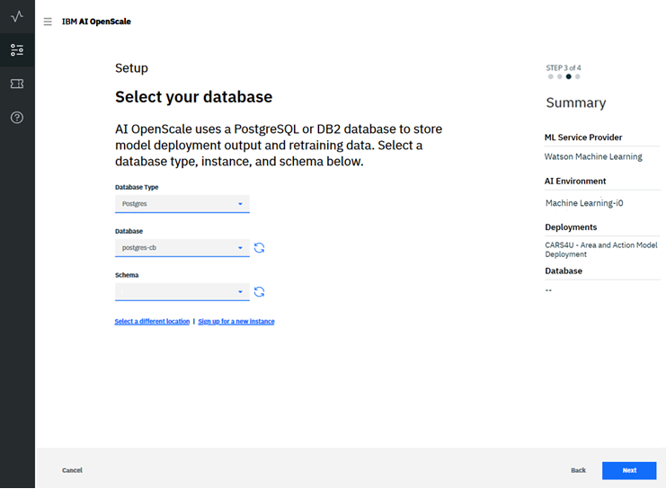

- Once you have selected the database and schema, click **Next** to review the summary data and click **Save**.

  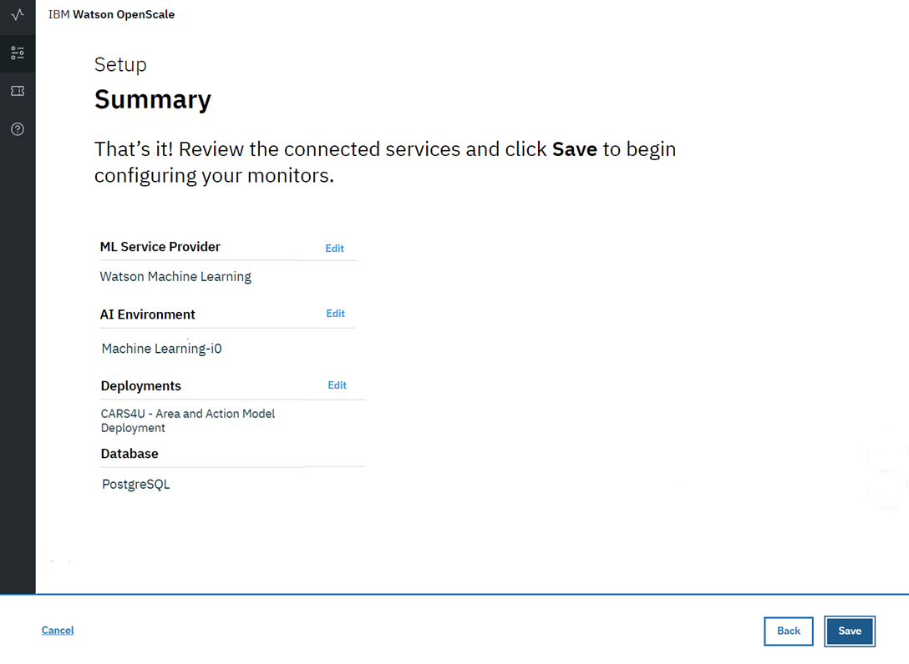

  Click **Exit to Dashboard** when prompted.

## Create a data mart and configure performance, accuracy, and fairness monitors

### Add the `AI OpenScale and Watson ML engine` notebook to your Watson Studio project

The `AI OpenScale and Watson ML engine` notebook contains detailed instructions for each step in the python code you will run. As you work through the notebook, spend some time to understand what each command is doing.
{: tip}

- Download the following file:

    - [AI OpenScale and Watson ML engine](https://github.com/pmservice/ai-openscale-tutorials/blob/master/notebooks/Data%20Mart%20configuration%20and%20usage%20-%20CARS4U.ipynb)

- From the **Assets** tab in your Watson Studio project, click the **Add to project** button and select **Notebook** from the dropdown:

  
  
- Select **From file**:

  

- Then click the **Choose file** button, and select the "AI OpenScale and Watson ML engine" that you downloaded:

  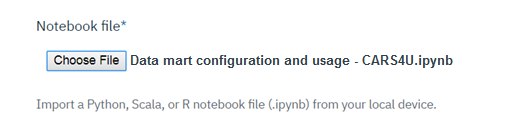

- In the **Select runtime** section, choose the Spark instance you created earlier from the dropdown list:

  
  
- Click **Create Notebook**.

### Edit and run the `AI OpenScale and Watson ML engine` Notebook

- From the **Assets** tab in your Watson Studio project, click the **Edit** icon next to the `AI OpenScale and Watson ML engine` notebook to edit it.

- In section 1.1, "Installation and authentication":

    - Under **ACTION: Get instance_id (GUID) and apikey**, follow the instructions to get your credentials. Replace the `aios_credentials` with your own.

    - Next, in **ACTION: Add your Watson Machine Learning credentials here**, replace the Watson Machine Learning credentials with the ones you created previously.

    - Finally, under **ACTION: Add your PostgreSQL credentials here**, replace the Postgres credentials with the ones you created previously.

- Once you have entered your credentials, your notebook is ready to run. Click the **Kernel** menu item, and select **Restart and Run All** from the menu:

  
  
  This will set up your data mart, enable payload logging, configure and score performance, accuracy, and fairness monitors, and provide those metrics to your {{site.data.keyword.aios_short}} instance.

## Viewing results

### View insights for your deployment

Using the [AI OpenScale dashboard ](https://aiopenscale.cloud.ibm.com/aiopenscale/){: new_window}, click on the **Insights** tab:

  

The Insights page provides an overview of metrics for your deployed models. You can easily see alerts for Fairness or Accuracy metrics that have fallen below the threshold set when running the notebook (70%). The data and settings used in this tutorial will have created Accuracy and Fairness metrics similar to the ones shown here.

  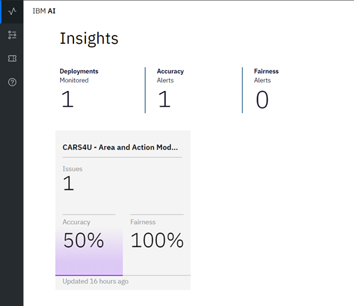

### View monitoring data for your deployment

Select a deployment by clicking the tile on the Insights page. The monitoring data for that deployment will appear. Slide the marker across the chart to select data for the timeframe during which you ran the notebook. Then select the **View details** link.

  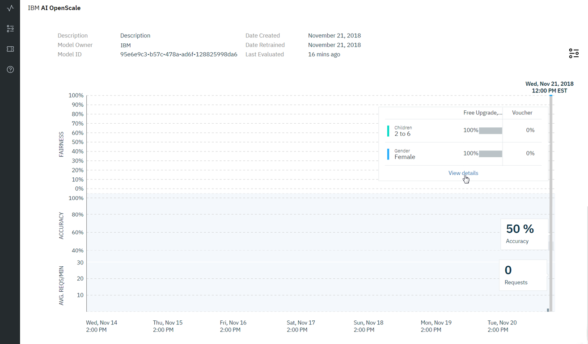

Now, you can review the charts for the data you monitored. For this example, you can use the **Feature** drop-down to select either "Children" or "Gender", in order to see details about the monitored data.

  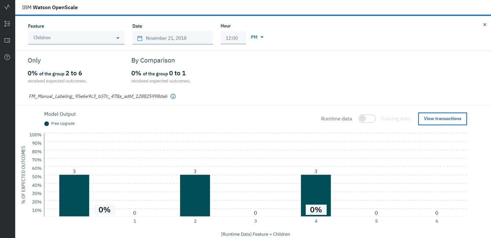

<!---

### View explainability for a model transaction

Select the **View transactions** button from the charts for the data you monitored.

  

  a list of transactions for the past hour is listed. Copy one of the transaction IDs.

  

Using the [AI OpenScale dashboard ](https://aiopenscale.cloud.ibm.com/aiopenscale/){: new_window}, click on the **Explainability** tab:

  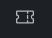

Paste the transaction ID value you copied into the search box and press **Return** on your keyboard. You will now see an explanation of how the model arrived at its conclusion, including how confident the model was, the factors that contributed to the confidence level, and the attributes fed to the model.

  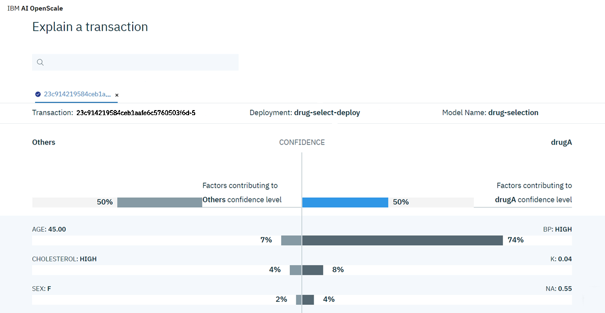

--->

## Next steps

- See the [Working with monitored data](insight-timechart.html) topic for more information.
